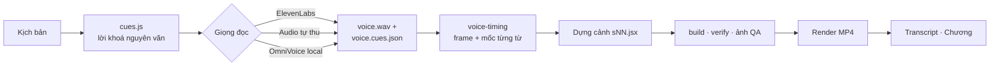

# VinUni Lesson Video Studio

Bộ công cụ sản xuất **video bài giảng tiếng Việt** cho khoá *AI in Action 20K* (VinUni): từ kịch bản đến
MP4 1920×1080 · 30 fps kèm transcript và file chương. Repo gồm một design system React/SVG, pipeline dựng và
kiểm tra chất lượng, ba nguồn giọng đọc (ElevenLabs, audio tự thu, model chạy dưới máy), và **Video Studio** —
giao diện web điều khiển toàn bộ quy trình bằng Claude Code, Codex hoặc Antigravity.

`Node ≥ 20` · `Next.js 16` · `React 19` · `Apache-2.0`

---

## Mục lục

- [Tổng quan](#tổng-quan)
- [Yêu cầu hệ thống](#yêu-cầu-hệ-thống)
- [Cài đặt](#cài-đặt)
- [Cấu hình](#cấu-hình)
- [Làm video bằng Video Studio](#làm-video-bằng-video-studio)
- [Làm video bằng CLI](#làm-video-bằng-cli)
- [Giọng đọc](#giọng-đọc)
- [Kịch bản và năng lực chọn thêm](#kịch-bản-và-năng-lực-chọn-thêm)
- [Nhạc nền và nhạc quiz](#nhạc-nền-và-nhạc-quiz)
- [Media nặng trên Cloudflare R2](#media-nặng-trên-cloudflare-r2)
- [Cấu trúc repo](#cấu-trúc-repo)
- [Lệnh thường dùng](#lệnh-thường-dùng)
- [Phát triển](#phát-triển)
- [Xử lý sự cố](#xử-lý-sự-cố)
- [Bảo mật](#bảo-mật)
- [Báo lỗi và đóng góp](#báo-lỗi-và-đóng-góp)
- [Giấy phép](#giấy-phép)

---

## Tổng quan

### Sản phẩm của mỗi video

| Sản phẩm | Vị trí | Mô tả |
|---|---|---|
| Video | `projects/<id>/render/<id>.mp4` | H.264 + AAC, 1920×1080, 30 fps, phụ đề burned-in, nhạc nền tuỳ chọn |
| Transcript | `transcripts/DayNN/<id>.txt` | `MM:SS - MM:SS: lời đọc`, sinh tự động từ giọng đã thu |
| Chương | `chapters/DayNN/<id>-chương.txt` | `MM:SS: tên chương`, mỗi phần kịch bản một chương |
| Ghi chú dựng | `projects/<id>/PROMPTS.md` | Kịch bản nguồn, giọng, lệnh đã chạy, feedback đã áp dụng |

### Nguyên tắc: giọng trước, hình sau

Lời đọc được **khoá nguyên văn** và thu giọng trước. Pipeline đo thời lượng thật của từng câu và mốc bắt
đầu của từng từ, rồi mới dựng cảnh đúng theo đó — hoạt ảnh đặt theo `spokenAt(n, 'cụm từ')`, tức lúc cụm từ
thật sự được đọc, không phải mốc ước lượng.



### Thành phần chính

| Thành phần | Thư mục | Vai trò |
|---|---|---|
| Design system | `vinuni-lesson-video-ds/` | Token màu/chữ, component, thư viện chuyển động, scene mẫu, video mẫu |
| Video Studio | `studio/` | Web local (Next.js) chạy toàn bộ quy trình, agent làm các bước cần sáng tạo |
| Pipeline | `tools/` | Build, verify, chụp QA, gắn giọng, render, transcript, nhập giọng, đẩy media |
| TTS ElevenLabs | `tts-elevenlabs/` | Tạo giọng theo từng câu, cache theo câu, trả mốc thời gian từng ký tự |
| Style | `styles/` | Bảng màu, component tiêu biểu và luật của từng style (`lesson`, `lesson-lab`) |
| Mẫu kịch bản | `templates/` | Mẫu cơ bản và các module năng lực (hội thoại, quiz) |
| Skill agent | `.claude/skills/` | `make-video` (quy trình chuẩn), `voice-align-check` |
| Danh mục | `voices.json`, `music.json` | Giọng, nhân vật, kiểu đọc; nhạc nền và nhạc quiz |

---

## Yêu cầu hệ thống

| Thành phần | Bắt buộc | Ghi chú |
|---|---|---|
| Node.js ≥ 20 (Studio cần ≥ 20.9) | Có | |
| git | Có | |
| Một agent CLI đã đăng nhập | Có, để dùng Studio | [Claude Code](https://claude.com/claude-code), Codex hoặc Antigravity (`agy`) |
| Python 3 | Tuỳ trường hợp | `npm run serve` (xem trước). Nhập giọng cần Python 3.10–3.12 hoặc `uv` |
| Tài khoản ElevenLabs | Tuỳ chọn | API key, nếu tạo giọng bằng ElevenLabs |
| GPU (CUDA hoặc Apple Silicon) | Tuỳ chọn | Để chạy OmniVoice đủ nhanh; dưới 8 GB VRAM chạy được nhưng sát |

Chrome và ffmpeg được cài tự động (`playwright` Chromium, `ffmpeg-static`). Muốn dùng bản có sẵn trên máy thì
đặt `CHROME=/đường/dẫn/chrome` và `FFMPEG=/đường/dẫn/ffmpeg`.

Hỗ trợ Windows, macOS và Linux.

---

## Cài đặt

```bash
git clone https://github.com/TuNM17421/video-studio.git
cd video-studio

npm install              # dependency, link design system vào node_modules, build dist/vk.js
npm run setup            # tải Chromium dùng để chụp frame và render (một lần)
npm run studio:install   # cài Video Studio (một lần)
npm run sample           # tải bản thu, MP4 và ảnh QA của video mẫu (chế độ tập của tour hướng dẫn)

npm run build && npm run verify   # kết thúc bằng "all checks passed" là cài đúng
```

Cài thêm theo nhu cầu:

```bash
npm run setup:voice      # nhập audio tự thu hoặc do model local tạo: voice/.venv + Whisper small (~460 MB)
npm run setup:omnivoice  # tự sinh giọng offline bằng OmniVoice: voice/.venv-omnivoice (1–4 GB + ~3,3 GB model)
```

> **Dùng OmniVoice cần cả hai lệnh:** `setup:omnivoice` để *sinh* giọng, `setup:voice` để *nhập* giọng đó vào
> video. Kiểm tra máy có chạy nổi không bằng `node tools/setup-omnivoice.mjs --check`.

---

## Cấu hình

Repo có ba file môi trường, mỗi file một mục đích. Tất cả đều bị `.gitignore` chặn.

| File | Ai cần | Nội dung |
|---|---|---|
| `tts-elevenlabs/.env` | Người tạo giọng bằng **CLI** | `ELEVENLABS_API_KEY`, model, định dạng, voice settings |
| `studio/.env` | Người muốn đổi agent mặc định | Công tắc **không bí mật**: `STUDIO_AGENT_PROVIDER`, `STUDIO_AGENT_PROVIDER_LOCKED`, đường dẫn CLI |
| `media/.env` | Chỉ **chủ bucket R2** | Khoá ghi lên Cloudflare R2 |

```bash
cp tts-elevenlabs/.env.example tts-elevenlabs/.env   # rồi điền ELEVENLABS_API_KEY
npm run tts:check                                    # kiểm tra key và giọng, không tốn ký tự

cp studio/.env.example studio/.env                   # tuỳ chọn: claude | codex | antigravity
```

- **Model ElevenLabs** phải hỗ trợ tiếng Việt: `eleven_flash_v2_5` (mặc định) hoặc `eleven_v3`.
  `eleven_multilingual_v2` không có tiếng Việt; `eleven_turbo_v2_5` đã ngừng hỗ trợ.
- **Video Studio không đọc `tts-elevenlabs/.env`.** Key được nhập trên web và chỉ nằm trong RAM của server.
  Người chỉ dùng Studio nên xoá file `.env` này, vì agent chạy trong repo có thể đọc được file trên đĩa.

---

## Làm video bằng Video Studio

```bash
npm run studio           # http://127.0.0.1:3100 — chỉ nghe trên máy này
```

### Các trang

| Trang | Đường dẫn | Dùng để |
|---|---|---|
| Video mới | `/` | Chọn style, nhập kịch bản, bật năng lực, tạo video |
| Các video | `/videos` | Mở lại video đang làm dở |
| Thư viện | `/library` | Xem style, toàn bộ component (tài liệu `.prompt.md`), nhân vật (`voices.json → characters`, kèm thẻ thoại xem thử và nghe thử giọng) và video mẫu |
| Design system | `/design-system` | Token giao diện của chính Studio |
| Hướng dẫn | `/guide` | Hướng dẫn dùng Studio |

### Quy trình

Mỗi video đi qua các bước dưới đây. Agent làm các bước cần sáng tạo; server tự chạy các bước kỹ thuật; bạn
duyệt hoặc gửi góp ý ở mỗi điểm dừng.

| Bước | Ai làm | Nội dung |
|---|---|---|
| **Kế hoạch** | Bạn | Chọn style, mã video, ngày, kịch bản (`.md`/`.txt`), năng lực chọn thêm (tick "Video có quiz" nếu có), feedback và video cũ nếu có. **Copy prompt** cho ra prompt tương đương để dán vào agent |
| **Lời & cue** | Agent | Viết `cues.js` với lời nguyên văn, dừng cho bạn đọc và duyệt |
| **Giọng đọc** | Server | ElevenLabs (có dry-run miễn phí trước), nhập audio có sẵn, hoặc OmniVoice local — xem [Giọng đọc](#giọng-đọc) |
| **Dựng cảnh** | Agent | Dựng cảnh theo độ dài giọng thật và mốc từng từ, build, verify, chụp ảnh QA |
| **Render MP4** | Server | Chọn có/không phụ đề, nhạc nền, nhạc quiz; render MP4 và transcript |
| **Bàn giao** | Agent | Viết file chương và `PROMPTS.md` |

Trạng thái mỗi video lưu ở `projects/<id>/.studio/` (không lên git), nên đóng Studio rồi mở lại vẫn tiếp tục
được.

### Agent

- Mặc định là Claude Code. Đổi bằng `STUDIO_AGENT_PROVIDER` trong `studio/.env`; đặt
  `STUDIO_AGENT_PROVIDER_LOCKED=1` để ẩn lựa chọn khi tạo video.
- Mỗi video **gắn cố định với agent** chọn lúc tạo, kể cả sau khi khởi động lại. Không đổi agent cho video
  đang làm. Video cũ chưa có trường provider được coi là video Claude.
- Agent chạy không hỏi quyền, trong giới hạn riêng của từng CLI:

  | Agent | Cơ chế giới hạn |
  |---|---|
  | Claude Code | Allowlist/denylist của Studio (`studio/src/lib/server/agent.ts`) |
  | Codex | Sandbox `workspace-write`, policy không xin quyền |
  | Antigravity | `--dangerously-skip-permissions` (bản headless không có allowlist theo lượt gọi) |

- Cả ba tuân theo `AGENTS.md`/`CLAUDE.md`: không đọc `.env`, không nhận key ElevenLabs, không tự tạo giọng tốn
  phí, không commit/push, không chạy `/design-sync`.

Khi phát triển Studio, `STUDIO_TTS_MOCK=1 npm run studio` tạo giọng im lặng thay vì gọi ElevenLabs.

---

## Làm video bằng CLI

Cách nhanh nhất: mở agent ở thư mục repo và gọi skill `make-video` (hoặc bấm **Copy prompt** ở bước Kế hoạch
của Studio rồi dán vào):

> /make-video d3-02-... — kịch bản ở `~/Downloads/...md`, Day03, style Lesson Lab. Làm đủ giọng, render,
> transcript và file chương.

Skill `.claude/skills/make-video/SKILL.md` là nguồn chuẩn của quy trình. Các bước tương ứng khi chạy tay
(`VIDEO` = `vinuni-lesson-video-ds/ui_kits/lesson-video/videos/<id>`):

**1. Kịch bản → cues.** Chép kịch bản vào `projects/<id>/kich-ban-goc.md`, viết `$VIDEO/cues.js` — mỗi câu đọc
một cue, lời giữ nguyên văn. Chốt lời trước khi tạo giọng.

**2. Giọng đọc** (chọn một nguồn, chi tiết ở [Giọng đọc](#giọng-đọc)), rồi gắn vào video:

```bash
node tools/voice-timing.mjs voice/out/<id>/voice.cues.json $VIDEO --write-cues
```

`--write-cues` ghi độ dài thật của từng câu vào `cues.js`; `voice.js` giữ mốc từng từ cho `spokenAt()`.

**3. Dựng cảnh.** Mỗi cue một `sNN.jsx`, theo luật của style và design system. Kèm `STORYBOARD.md`.

**4. Build và QA.**

```bash
npm run build && npm run verify
node tools/shoot.mjs --batch projects/<id>/qa/jobs.json     # chụp các frame quan trọng, rồi mở ảnh ra xem
```

**5. Render** (cần một server phục vụ design system — `npm run serve`, hoặc `/ds` của Studio đang chạy):

```bash
node tools/render.mjs --scene <id> --audio voice/out/<id>/voice.wav --out projects/<id>/render/<id>.mp4 \
  [--music-track bg-02] [--quiz-track <id>] [--no-captions] [--base http://127.0.0.1:3100/ds]
```

Mặc định video có thanh phụ đề xanh chữ trắng ở cuối khung hình; `--no-captions` bỏ nó khỏi mọi frame
(tương đương `?captions=0` của player). Trên Studio đây là lựa chọn **Phụ đề: Có / Không** ở bước Render.

Render dừng và báo lỗi nếu độ dài giọng khác độ dài hình. Sau khi render, kiểm tra MP4: thời lượng, vài frame
trích từ file, âm lượng.

**6. Sản phẩm đi kèm.**

```bash
node tools/transcript.mjs voice/out/<id>/voice.cues.json transcripts/DayNN/<id>.txt
```

Viết thêm `chapters/DayNN/<id>-chương.txt` và `projects/<id>/PROMPTS.md`.

### Xem trước

```bash
npm run serve            # http://127.0.0.1:8765
```

| Trang | URL |
|---|---|
| Toàn bộ card component | `/gallery.html` |
| Scene kit và video (Space phát/dừng, ← → tua) | `/ui_kits/lesson-video/index.html` |
| Trình phát một video | `/ui_kits/lesson-video/videos/<id>/player.html` |
| Một frame chính xác | `/ui_kits/lesson-video/index.html?scene=<id>&frame=300` |

**Video mẫu nên xem trước:** `d2-01-lab` (đầy đủ, đã QA) và `n2-00-gioi-thieu-ngay-2` (ngắn hơn). Mã nguồn ở
`vinuni-lesson-video-ds/ui_kits/lesson-video/videos/`, kịch bản ở `projects/`, transcript và chương ở `Day02/`.
MP4 và WAV không có trên git — tạo lại giọng theo bước 2 nếu cần.

---

## Giọng đọc

Ba nguồn giọng đều cho ra cùng hai file `voice/out/<id>/voice.wav` và `voice.cues.json`, nên các bước sau
không phân biệt nguồn.

| Nguồn | Chi phí | Cần cài | Phù hợp khi |
|---|---|---|---|
| **ElevenLabs** | Tính theo ký tự | API key | Cần giọng ổn định, có video hội thoại nhiều giọng |
| **Audio tự thu** | Miễn phí | `setup:voice` | Có người đọc thật |
| **OmniVoice local** | Miễn phí | `setup:omnivoice` + `setup:voice` | Có GPU, muốn làm offline |

### ElevenLabs

```bash
# 1. Dry-run: in từng câu, kiểu đọc, tốc độ và số ký tự sẽ bị tính phí — chưa gửi gì
node tts-elevenlabs/tts.mjs generate --cues $VIDEO/cues.js --pronounce projects/<id>/pronounce.json \
  --out voice/out/<id> --dry-run

# 2. Gọi API thật
node tts-elevenlabs/tts.mjs generate --cues $VIDEO/cues.js --pronounce projects/<id>/pronounce.json \
  --out voice/out/<id>
```

Kết quả được cache theo từng câu. Lưu ý: với model không phải `eleven_v3`, mỗi câu được gửi kèm câu trước và
câu sau để giữ ngữ điệu, nên sửa một câu có thể làm cả hai câu liền kề bị tạo lại.

### Audio tự thu

```bash
node tools/voice-export.mjs $VIDEO --out projects/<id>/voice-script   # bản đọc doc-thu.md, doc-thu.txt, voice-batch.jsonl
# thu thành 01.wav, 02.wav … đúng số câu, để chung một thư mục
node tools/voice-import.mjs --cues $VIDEO/cues.js --from <thư mục audio> --scan   # xem tệp nào ứng với câu nào
node tools/voice-import.mjs --cues $VIDEO/cues.js --from <thư mục audio>
```

Whisper đối chiếu bản nghe được với lời đã khoá; câu nào khớp quá thấp bị chặn vì gần như chắc chắn là nhầm
tệp. `node tools/align-health.mjs` (hoặc skill `/voice-align-check`) cho biết chất lượng căn mốc từng từ còn đủ
dùng hay không.

### OmniVoice local

```bash
node tools/omnivoice-generate.mjs --cues $VIDEO/cues.js --voice "Nhật Phong" --out projects/<id>/voice-script/omnivoice
node tools/voice-import.mjs --cues $VIDEO/cues.js --from projects/<id>/voice-script/omnivoice
```

Đặt tên tệp đúng số câu, bỏ qua câu `silent`, thiếu dù một câu là báo lỗi. Model chỉ nhân bản một giọng cho
cả video, nên **video có nhân vật (`speaker`) không dùng được OmniVoice**. Hỗ trợ Windows (CUDA), macOS Apple
Silicon (MPS), Linux (CUDA/CPU); Mac Intel chỉ chạy CPU. Gỡ bằng cách xoá `voice/.venv-omnivoice`.

### Danh mục giọng, nhân vật và kiểu đọc

`voices.json` là danh mục được commit (xem nhanh bằng `npm run voices`):

- `voices` — giọng: id, tên, giới tính, mẫu nghe thử trên R2, một giọng `"default": true`. Thứ tự ưu tiên khi
  chọn giọng: `--voice <id|tên>` → `ELEVENLABS_VOICE_ID` → giọng mặc định.
- `characters` — nhân vật dùng trong video hội thoại: tên, avatar, phía, màu, và giọng nó mượn.
- `deliveries` — năm kiểu đọc (`ke`, `giang`, `nhe`, `hoi`, `nhan`), mỗi kiểu một tốc độ.

Phát âm thuật ngữ khai trong `projects/<id>/pronounce.json`. `node tools/voice-sample.mjs` đọc thử một đoạn
bằng nhiều giọng ElevenLabs để chọn người dẫn (luôn chạy `--dry-run` trước).

---

## Kịch bản và năng lực chọn thêm

Mọi video viết theo **`templates/kich-ban-co-ban.md`**: một người dẫn, mỗi mục là một câu đọc và một cảnh, có
**Kiểu**, **Lời** (khoá nguyên văn) và **Trên màn hình**. Mẫu quy định cách viết để máy đọc đúng: không chữ
số, không viết tắt, thuật ngữ tiếng Anh đi sau nghĩa tiếng Việt, không bịa số liệu.

Năng lực chọn thêm là **một file** trong `templates/modules/`, chỉ ghi phần khác so với mẫu cơ bản:

| Module | File | Thay đổi |
|---|---|---|
| Video có hội thoại | `dialogue.md` | Nhiều người nói; mỗi cue khai `speaker` và `delivery` |
| Video có quiz | `quiz.md` | Câu hỏi có khoảng chờ người xem suy nghĩ, nhạc quiz riêng |

Frontmatter của file module (`name`, `summary`, `icon`, `preview`, `order`) chính là card ở bước Kế hoạch.
**Thêm năng lực = thêm một file**; chỉ năng lực cần cấu hình riêng trên form mới phải sửa code. Không đổi tên
file của module đã có video dùng. Chi tiết: `templates/modules/README.md`.

---

## Nhạc nền và nhạc quiz

`music.json` là danh mục nhạc: `id`, `media` (key trên R2), `seconds` và `lufs` — độ to đo được. Các bản master
chênh nhau tới 15 dB, nên gain được suy từ `lufs` về **−32 LUFS** (nhạc nền) và **−28 LUFS** (nhạc quiz). File
tự tải về `assets/music/` ở lần dùng đầu.

- **Nhạc nền** chọn ở bước Render → `render.mjs --music-track <id>`. Nhạc lặp và cắt đúng độ dài giọng.
- **Nhạc quiz** cũng chọn ở bước Render (hiện khi `cues.js` có câu `quiz: true`). Bước Kế hoạch chỉ cần tick
  **"Video có quiz"** để agent biết đánh dấu `quiz: true` khi viết `cues.js`. Cờ này
  chỉ đặt ở **khoảng chờ người xem suy nghĩ** (cue `silent`), không đặt ở câu đọc câu hỏi hay phần chữa bài.
  Trong đoạn quiz, nhạc nền tắt hẳn, nhạc quiz vào, fade 0,5 giây hai đầu.
- `quiz: true` phải đặt **cuối phần khai của câu** — `voice-timing --write-cues` ghi đè vùng ngay sau `n:`.
- `--music-db` / `--quiz-db` chỉnh to nhỏ cho riêng một lần render.

Thêm bản nhạc: đẩy file lên R2, thêm mục vào `music.json` kèm `lufs` đo bằng `ffmpeg -af ebur128`.

---

## Media nặng trên Cloudflare R2

Video mẫu, mẫu giọng, avatar và nhạc không nằm trong git mà ở một bucket R2 **đọc công khai**.
`media/manifest.json` (được commit) giữ base URL và danh sách asset, nên ai clone repo cũng xem được mà không
cần cấu hình. Mất mạng thì Studio hiện card "không khả dụng", phần còn lại vẫn chạy.

Chỉ chủ bucket mới đẩy media:

```bash
cp media/.env.example media/.env     # điền khoá R2
# bỏ file vào media/files/<key>, ví dụ media/files/styles/lesson/sample.mp4
npm run media -- --dry-run
npm run media
git add media/manifest.json          # commit manifest để cả nhóm thấy media mới
```

Chi tiết (quy ước tên, `--prune`, cache): `media/README.md`.

---

## Cấu trúc repo

```text
.
├── studio/                      Video Studio (Next.js, cổng 3100)
├── vinuni-lesson-video-ds/      Design system video bài giảng
│   ├── lib/                     tokens.js (màu), speech.js (spokenAt), captions.js, chuyển động
│   ├── components/<nhóm>/       Component + .d.ts + .prompt.md + một card .html
│   ├── ui_kits/lesson-video/    Scene mẫu và videos/<id>/ (cues.js, sNN.jsx, timeline.js, voice.js)
│   └── dist/vk.js               Bundle, sinh bởi npm run build (không lên git)
├── tools/                       Pipeline: build, verify, shoot, render, voice-*, transcript, media-push
├── tts-elevenlabs/              TTS ElevenLabs + cache theo câu
├── voice/                       Output giọng (out/<id>/), venv Whisper và OmniVoice (theo máy)
├── styles/                      lesson.json, lesson-lab.json, previews/
├── templates/                   Mẫu kịch bản cơ bản + modules/
├── projects/<id>/               Kịch bản, REQUEST.md, PROMPTS.md, qa/, render/, .studio/
├── transcripts/DayNN/           Transcript
├── chapters/DayNN/              File chương
├── media/                       manifest.json + media/files/ (không lên git)
├── voices.json · music.json     Danh mục giọng, nhân vật, kiểu đọc; danh mục nhạc
├── .claude/skills/              make-video, voice-align-check
├── .design-sync/ · .ds-sync/    Đồng bộ design system lên Claude Design
├── AGENTS.md · CLAUDE.md        Quy ước bắt buộc cho agent
└── .github/                     Mẫu báo lỗi và bộ nhãn issue
```

### Cái gì lên git

Git chỉ giữ **phần dùng chung**: Studio, pipeline, design system, style, template và danh mục. Dữ liệu theo từng
video giữ trên máy:

| Lên git | Chỉ ở máy |
|---|---|
| Mã nguồn `studio/`, `tools/`, `tts-elevenlabs/` | `.env` (mọi thư mục) |
| `vinuni-lesson-video-ds/` (trừ `dist/`) | `vinuni-lesson-video-ds/dist/` |
| `styles/`, `templates/`, `voices.json`, `music.json` | `projects/<id>/`, `videos/<id>/` của video mới |
| `media/manifest.json` | `*.wav`, `*.mp3`, `*.mp4`, `media/files/` |
| Ba video mẫu Day02 đã duyệt | `voice/out/`, venv, cache, `transcripts/Day*/`, `chapters/Day*/` |
| | `docs/` (ghi chú quyết định nội bộ) |

---

## Lệnh thường dùng

### Ở gốc repo

| Lệnh | Tác dụng |
|---|---|
| `npm install` | Cài dependency, link design system, build `dist/vk.js` |
| `npm run setup` | Tải Chromium cho playwright |
| `npm run setup:voice` | Môi trường Whisper để nhập giọng |
| `npm run setup:omnivoice` | Môi trường OmniVoice để sinh giọng offline |
| `npm run build` | Build bundle design system (~1,5 giây) |
| `npm run verify` | Kiểm tra design system và mọi video |
| `npm run serve` | Phục vụ design system ở cổng 8765 |
| `npm run studio:install` | Cài Video Studio |
| `npm run studio` | Chạy Video Studio ở cổng 3100 |
| `npm run tts:check` | Kiểm tra key và giọng ElevenLabs, không tốn ký tự |
| `npm run voices` | In danh mục giọng và kiểu đọc |
| `npm run media` | Đẩy media lên R2 (chủ bucket) |
| `npm run sample` | Tải phần nặng của video mẫu `mau-huong-dan` từ R2 (bản thu, MP4, ảnh QA) |
| `npm run test:tools` | Test của `tools/` |

### Trong `studio/`

| Lệnh | Tác dụng |
|---|---|
| `npm run dev` | Dev server (`npm run studio` ở gốc gọi lệnh này) |
| `npm run lint` · `typecheck` · `test` | ESLint, TypeScript, Vitest |
| `npm run check` | Chạy cả lint, typecheck, test và build |

---

## Phát triển

### Nhánh

| Nhánh | Mục đích |
|---|---|
| `main` | Design system đã duyệt, dùng cho video chính thức |
| `lab` | Nghiên cứu: component, màu, tính năng mới |
| `ui-labs` | Thử nghiệm giao diện Studio |
| `feat/<tên>` | Việc của từng thành viên |

Mọi thay đổi vào `main` qua Pull Request. Repo chỉ giữ **một** thư mục design system — thử nghiệm nằm trên
nhánh, không nhân đôi thư mục.

### Sửa design system

- Đọc `vinuni-lesson-video-ds/README.md` (mười hai luật cốt lõi) và `SKILL.md` trước khi thiết kế.
- Luật chính: khung 1920×1080 · 30 fps; nội dung trong vùng **y 250–960, x 80–1840**; phụ đề ≤ 78 ký tự mỗi
  trang; chỉ Montserrat; chuyển động là hàm thuần của frame (không `Math.random`, `Date.now`).
- Màu mới **chỉ** được khai báo trong `lib/tokens.js`.
- Mỗi component cần `.d.ts`, `.prompt.md` và đúng một card `.html` trong thư mục nhóm.
- Chạy `npm run build && npm run verify` sau mỗi thay đổi (cảnh báo được, lỗi thì không).

### Thêm style

1. Tạo `styles/<id>.json` theo mẫu `styles/lesson-lab.json`: `name`, `summary`, `extends`, `palette`,
   `showcase`, `rules`, `sampleVideo`.
2. Màu mới khai trong `lib/tokens.js`; component mới thêm vào design system trên nhánh `lab`.
3. Video mẫu của style: đẩy lên R2 theo key `styles/<id>/sample.mp4`.

Studio và skill `make-video` đọc thẳng các file này, không cần sửa code.

### Ảnh preview component

Studio hiển thị `styles/previews/<nhóm>__<Component>.png` trong Thư viện. Cách tạo: viết một file HTML tạm trong
`vinuni-lesson-video-ds/ui_kits/lesson-video/demos/` dựng component bằng `VK.mountCard`, chạy `npm run serve`, rồi:

```bash
node tools/shoot.mjs "http://127.0.0.1:8765/ui_kits/lesson-video/demos/<file>.html" \
  styles/previews/<nhóm>__<Component>.png 367 210
```

Rộng chuẩn 367 px. `shoot.mjs` **cắt** theo viewport chứ không thu nhỏ — tự thu bằng `transform: scale(...)`,
và luôn mở ảnh ra xem vì phần tràn mép bị xén mà không báo lỗi. Xoá file HTML tạm sau khi chụp.

### Giao diện Studio

Mọi thay đổi UI trong `studio/` theo **`studio/src/lib/design-tokens.ts`** — nguồn chuẩn duy nhất cho màu, chữ,
bố cục và motion (xem trực quan ở `/design-system`). Không viết mã hex mới vào component; cần giá trị mới thì
thêm token trước. Đây là design system của **giao diện Studio**, khác với design system của video.

Trước khi sửa code Next.js, đọc tài liệu đi kèm trong `studio/node_modules/next/dist/docs/` (xem
`studio/AGENTS.md`).

### Đồng bộ lên Claude Design

Skill `/design-sync` đẩy `vinuni-lesson-video-ds/` lên project trong `.design-sync/config.json`, sau khi bạn duyệt
danh sách file. Mỗi thành viên dùng tài khoản claude.ai của mình (`/design-login` khi báo lỗi quyền). Muốn dùng
project riêng thì sửa `projectId` ở máy, **không commit** thay đổi đó. Ghi chú kỹ thuật: `.design-sync/NOTES.md`.

---

## Xử lý sự cố

| Triệu chứng | Nguyên nhân và cách xử lý |
|---|---|
| Card hoặc player ra trang trắng; `verify` báo thiếu bundle | Chưa có `dist/vk.js`. Chạy `npm run build` |
| `verify` báo lỗi ở một video không liên quan | `verify` và `build` quét **mọi** thư mục trong `videos/`. Thư mục video bỏ dở (thiếu `video.jsx`, `card.html`…) làm hỏng cả lượt — hoàn tất hoặc xoá thư mục đó |
| `npm run serve` báo không tìm thấy `python3` (thường gặp trên Windows) | Chạy `python -m http.server 8765 --bind 127.0.0.1 --directory vinuni-lesson-video-ds`, hoặc dùng `/ds` của Studio làm `--base` |
| Chromium báo thiếu thư viện hệ thống (Linux) | `npx playwright install-deps chromium` (cần sudo) |
| Render chậm trên Windows | Studio ép 1 worker trên Windows để tránh treo khi chụp nhiều tab. Chạy CLI có thể thử `--workers` lớn hơn |
| Render hỏng giữa chừng | Chạy lại cùng lệnh với `--keep-frames <thư mục>`: chỉ các frame còn thiếu được vẽ lại |
| `render.mjs` báo độ dài giọng khác độ dài hình | Chạy lại `voice-timing --write-cues` sau khi đổi giọng, rồi build lại |
| `voice-timing` báo lời khác `cues.js` | Lời đã bị sửa sau khi thu. Tạo lại giọng cho câu đó |
| Bước nhập giọng báo chưa có Whisper | `npm run setup:voice` |
| `--dry-run` chặn một kiểu đọc hoặc người nói | Chỉ dùng kiểu và nhân vật có trong `voices.json` (`npm run voices`) |
| ElevenLabs báo model không hợp lệ | Dùng `eleven_flash_v2_5` hoặc `eleven_v3` |
| Card video mẫu hiện "không khả dụng" | Mất mạng hoặc bucket R2 lỗi; phần còn lại của Studio vẫn chạy |
| Mất key ElevenLabs sau khi tắt Studio | Key chỉ nằm trong RAM — nhập lại sau mỗi lần khởi động |

---

## Bảo mật

- **Không bao giờ** commit, in ra hoặc dán vào chat nội dung `tts-elevenlabs/.env`, `media/.env` hay bất kỳ
  `.env` nào.
- Studio giữ key ElevenLabs trong RAM của server; agent không nhận được key, không được đọc `.env`, không được
  tự tạo giọng tốn phí.
- Studio chỉ nghe trên `127.0.0.1`. Không mở cổng 3100 ra mạng.
- Mọi lần gọi ElevenLabs đều tính phí: luôn chạy `--dry-run` trước.

---

## Báo lỗi và đóng góp

- Báo lỗi và đề xuất qua **GitHub Issues**. Làm theo issue mẫu "📌 [MẪU] Cách báo lỗi"; mỗi issue gắn một nhãn
  loại, một nhãn khu vực và một nhãn mức độ (bộ nhãn trong `.github/nhan-issue.md`).
- Trước khi mở Pull Request: `npm run build && npm run verify` phải qua; sửa `studio/` thì chạy thêm
  `npm run check --prefix studio`; sửa `tools/lib` thì chạy `npm run test:tools`.
- Chỉ stage phần dùng chung (pipeline, Studio, design system, style, template). Dữ liệu theo từng video đã bị
  `.gitignore` loại.
- Làm việc bằng agent: agent phải tuân `AGENTS.md` và `CLAUDE.md`.

---

## Giấy phép

Copyright 2026 Nguyễn Mạnh Tú.

Phát hành theo [Apache License 2.0](LICENSE). Xem thêm [NOTICE](NOTICE).
