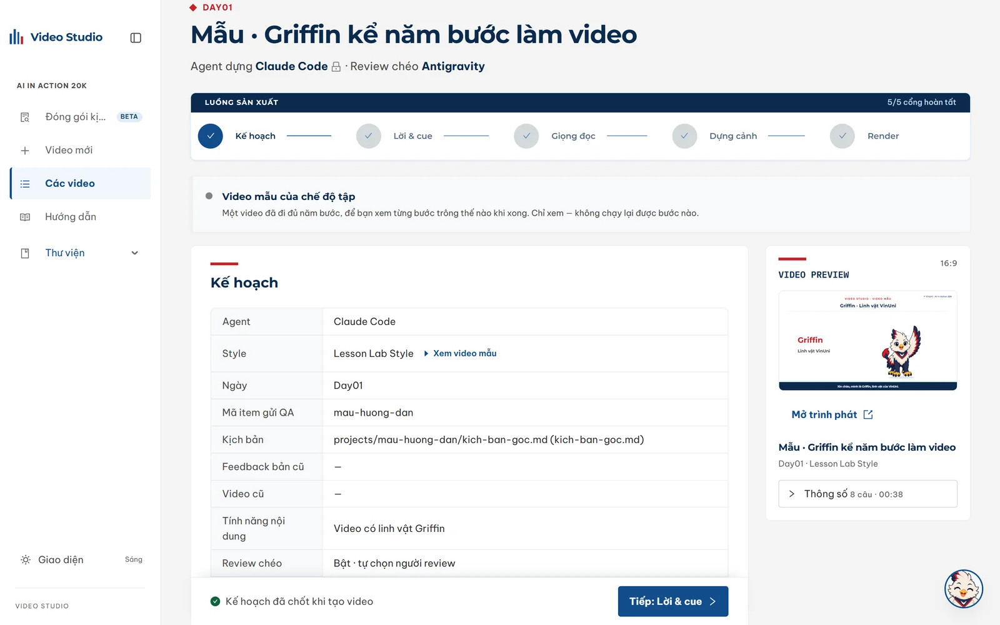
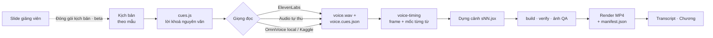
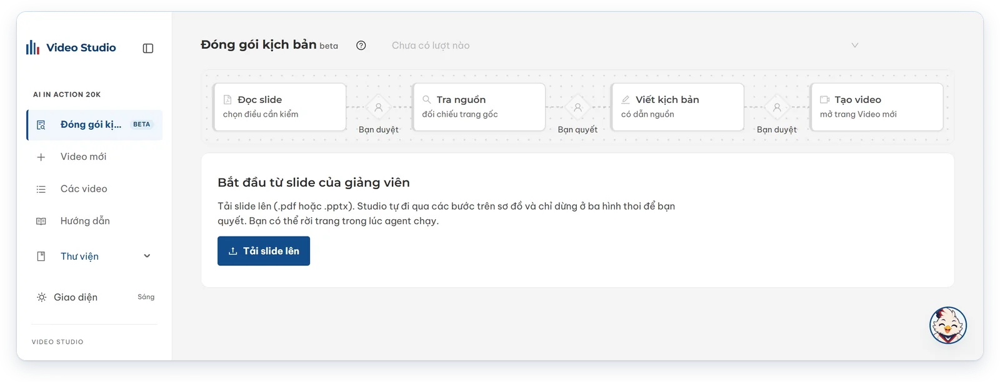
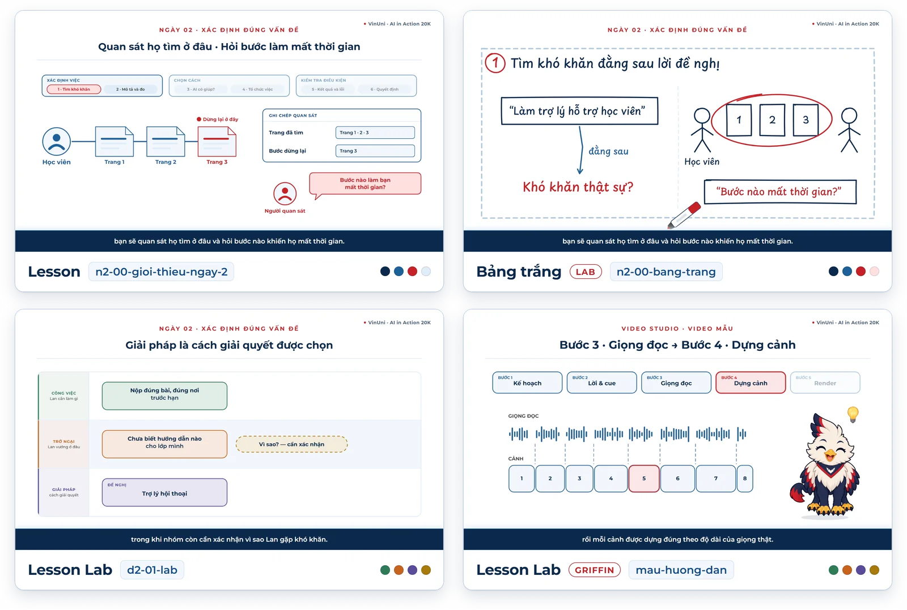

# VinUni Lesson Video Studio

Bộ công cụ sản xuất **video bài giảng tiếng Việt** cho khoá *AI in Action 20K* (VinUni) — từ slide của giảng viên
tới MP4 1920×1080 · 30 fps sẵn sàng gửi đội QA, kèm transcript và file chương.

`Node ≥ 20 (khuyên dùng 22)` · `Next.js 16` · `React 19` · `Ant Design 6` · `Apache-2.0`

- **Video Studio** — web chạy trên máy, điều khiển toàn bộ quy trình bằng agent CLI bạn đã đăng nhập sẵn
  (Claude Code, Codex hoặc Antigravity). Không cần API key LLM.
- **Đóng gói kịch bản** *(beta)* — từ slide giảng viên, agent tra nguồn trên web, Studio đối chiếu từng trích dẫn
  với trang gốc rồi viết kịch bản đúng mẫu, mỗi câu ghi nguồn.
- **Giọng trước, hình sau** — bốn nguồn giọng (ElevenLabs, audio tự thu, OmniVoice trên máy hoặc trên GPU Kaggle);
  cảnh được dựng theo mốc từng từ đo từ giọng thật.
- **Design system React/SVG** — ba style (Lesson, Lesson Lab và Bảng trắng đang thử nghiệm), thư viện component,
  linh vật Griffin và nhân vật cho video hội thoại.
- **Code soát ở mọi cổng** — mẫu kịch bản, trích dẫn, build/verify, ảnh QA có review chéo, `manifest.json` cho
  platform QA.



---

## Mục lục

- [Tổng quan](#tổng-quan)
- [Bắt đầu nhanh](#bắt-đầu-nhanh)
- [Yêu cầu hệ thống](#yêu-cầu-hệ-thống)
- [Cài đặt](#cài-đặt)
- [Cấu hình](#cấu-hình)
- [Video Studio](#video-studio)
- [Đóng gói kịch bản từ slide](#đóng-gói-kịch-bản-từ-slide)
- [Làm video bằng CLI](#làm-video-bằng-cli)
- [Giọng đọc](#giọng-đọc)
- [Style hình ảnh](#style-hình-ảnh)
- [Kịch bản và năng lực chọn thêm](#kịch-bản-và-năng-lực-chọn-thêm)
- [Nhạc nền, nhạc quiz và âm lượng](#nhạc-nền-nhạc-quiz-và-âm-lượng)
- [Bàn giao cho platform QA](#bàn-giao-cho-platform-qa)
- [Media nặng trên Cloudflare R2](#media-nặng-trên-cloudflare-r2)
- [Cấu trúc repo](#cấu-trúc-repo)
- [Lệnh thường dùng](#lệnh-thường-dùng)
- [Phát triển](#phát-triển)
- [Xử lý sự cố](#xử-lý-sự-cố)
- [Bảo mật](#bảo-mật)
- [Báo lỗi và đóng góp](#báo-lỗi-và-đóng-góp)
- [Giấy phép](#giấy-phép)

---

## Tổng quan

### Hai pipeline, một điểm bàn giao

| Pipeline | Đầu vào | Đầu ra | Trạng thái |
|---|---|---|---|
| **Đóng gói kịch bản** | Slide PPTX/PDF của giảng viên | Kịch bản theo mẫu, mỗi câu dẫn nguồn | Beta |
| **Dựng video** | Kịch bản theo mẫu — viết tay hoặc từ pipeline trên | MP4, `manifest.json`, transcript, file chương | Chính thức |

Hai pipeline gặp nhau ở mẫu `templates/kich-ban-co-ban.md`, và cả hai soát kịch bản bằng cùng một lệnh
(`node tools/script-check.mjs`), nên kịch bản viết tay hay kịch bản do agent đóng gói đều đi vào cùng một luồng.



### Sản phẩm của mỗi video

| Sản phẩm | Vị trí | Mô tả |
|---|---|---|
| Video | `projects/<id>/render/<id>.mp4` | H.264 + AAC, 1920×1080, 30 fps; phụ đề burned-in và nhạc nền tuỳ chọn; âm lượng chuẩn −16 LUFS |
| Manifest QA | `projects/<id>/render/manifest.json` | Bắt buộc để platform QA của trường nhận MP4 — xem [Bàn giao cho platform QA](#bàn-giao-cho-platform-qa) |
| Transcript | `transcripts/DayNN/<id>.txt` | `MM:SS - MM:SS: lời đọc`, sinh từ mốc thời gian của giọng thật |
| Chương | `chapters/DayNN/<id>-chương.txt` | `MM:SS: tên chương`, mỗi phần kịch bản một chương |
| Ghi chú dựng | `projects/<id>/PROMPTS.md` | Kịch bản nguồn, style, giọng, lệnh đã chạy, feedback đã áp dụng |

### Nguyên tắc thiết kế

- **Giọng trước, hình sau.** Lời đọc được khoá nguyên văn và thu giọng trước. Pipeline đo thời lượng thật của từng
  câu và mốc bắt đầu của từng từ, rồi mới dựng cảnh — hoạt ảnh đặt theo `spokenAt(n, 'cụm từ')`, tức lúc cụm từ
  thật sự được đọc, không phải mốc ước lượng.
- **Code soát, không tin lời agent.** Ở mỗi cổng, phần kiểm tra do code làm: mẫu kịch bản, trích dẫn đối chiếu với
  trang gốc do Studio tự tải, build/verify, ảnh QA, manifest. Agent chỉ làm phần cần phán đoán.
- **Không cần API key LLM.** Studio gọi agent CLI đã đăng nhập sẵn trên máy; mỗi video gắn với một agent.
- **Bí mật chỉ nằm trong RAM.** Key ElevenLabs và thông tin Kaggle nhập trên web, không ghi xuống đĩa, agent không
  nhận được.

### Thành phần chính

| Thành phần | Thư mục | Vai trò |
|---|---|---|
| Video Studio | `studio/` | Web chạy trên máy (Next.js), điều khiển cả hai pipeline |
| Design system | `vinuni-lesson-video-ds/` | Token màu/chữ, component, chuyển động, linh vật Griffin, scene và video mẫu |
| Pipeline | `tools/` | Build, verify, chụp QA, giọng, render, transcript, manifest QA, research, đề xuất ảnh, media |
| TTS ElevenLabs | `tts-elevenlabs/` | Tạo giọng theo từng câu, cache theo câu, trả mốc thời gian từng ký tự |
| Style | `styles/` | `<id>.json` (bảng màu, component tiêu biểu, luật) và `<id>.md` (cách dựng cảnh, tiêu chí QA) |
| Mẫu kịch bản | `templates/` | Mẫu cơ bản và bốn module năng lực: hội thoại, quiz, linh vật, ảnh tư liệu |
| Skill agent | `.claude/skills/` | `make-video`, `research-script`, `image-suggest`, `voice-align-check` |
| Danh mục | `voices.json` · `music.json` · `images.policy.json` | Giọng, nhân vật, kiểu đọc · nhạc · chính sách giấy phép ảnh |

---

## Bắt đầu nhanh

```bash
git clone https://github.com/TuNM17421/video-studio.git
cd video-studio
npm install && npm run setup && npm run studio:install
npm run sample     # tuỳ chọn: bản thu, MP4 và ảnh QA của video mẫu cho chế độ tập
npm run studio     # mở http://127.0.0.1:3100
```

Nút **Griffin** ở góc phải mở tour hướng dẫn của trang đang xem; chọn **Chế độ tập** để xem một video mẫu đã đi đủ
năm bước sản xuất, ở chế độ chỉ xem. Trước khi làm video thật, đọc [Cài đặt](#cài-đặt) và [Cấu hình](#cấu-hình).

---

## Yêu cầu hệ thống

| Thành phần | Bắt buộc | Ghi chú |
|---|---|---|
| Node.js ≥ 20 (Studio ≥ 20.9) | Có | **Khuyên dùng Node 22+** — cần để bóc chữ slide PDF trong Đóng gói kịch bản (`unpdf`) |
| git | Có | |
| Một agent CLI đã đăng nhập | Có, để dùng Studio | [Claude Code](https://claude.com/claude-code), Codex hoặc Antigravity (`agy`) |
| Python 3 | Tuỳ trường hợp | `npm run serve` gọi `python3`; nhập giọng cần Python 3.10–3.12 hoặc `uv` |
| Tài khoản ElevenLabs | Tuỳ chọn | API key, nếu tạo giọng bằng ElevenLabs |
| Tài khoản Kaggle | Tuỳ chọn | Sinh giọng OmniVoice trên GPU miễn phí; tài khoản phải đã xác minh số điện thoại |
| GPU (CUDA hoặc Apple Silicon) | Tuỳ chọn | Để chạy OmniVoice trên máy đủ nhanh; dưới 8 GB VRAM chạy được nhưng sát |

Chrome và ffmpeg được cài tự động (`playwright` Chromium, `ffmpeg-static`). Muốn dùng bản có sẵn trên máy thì đặt
`CHROME=/đường/dẫn/chrome` và `FFMPEG=/đường/dẫn/ffmpeg`. Hỗ trợ Windows, macOS và Linux.

---

## Cài đặt

```bash
git clone https://github.com/TuNM17421/video-studio.git
cd video-studio

npm install              # dependency, link design system vào node_modules, build dist/vk.js
npm run setup            # tải Chromium dùng để chụp frame và render (một lần)
npm run studio:install   # cài Video Studio (một lần)
npm run sample           # tải bản thu, MP4 và ảnh QA của video mẫu (chế độ tập)

npm run doctor                    # kiểm tra môi trường — chỉ đọc và báo cáo, không sửa gì trên máy
npm run build && npm run verify   # kết thúc bằng "all checks passed" là cài đúng
```

Cài thêm theo nhu cầu:

```bash
npm run setup:voice      # nhập audio tự thu hoặc do model tạo: faster-whisper + Whisper small (~860 MB)
npm run setup:omnivoice  # sinh giọng offline bằng OmniVoice (1–4 GB + ~3,3 GB model)
npm run setup:kaggle     # sinh giọng OmniVoice trên GPU của Kaggle: chỉ cài Kaggle CLI (vài chục MB)
```

> **Một bản cho cả máy.** Các môi trường trên không cài theo từng checkout: có sẵn ở đâu thì dùng lại —
> `voice/.venv` / `voice/.venv-omnivoice` của checkout này, thư mục dùng chung (`~/.cache/video-studio/`,
> macOS `~/Library/Caches/video-studio/`, Windows `%LOCALAPPDATA%\video-studio\`), hoặc một worktree khác
> của repo; model Whisper lấy luôn từ cache Hugging Face nếu đã có. Chỉ khi không thấy ở đâu cả mới cài,
> và cài vào thư mục dùng chung. `node tools/setup-voice-align.mjs --where` cho biết đang dùng bản nào;
> `--local` cài vào checkout như trước; `VOICE_ALIGN_VENV`, `OMNIVOICE_VENV`, `VOICE_ALIGN_CACHE`,
> `VIDEO_STUDIO_HOME` chỉ định thẳng chỗ khác.

> **Dùng OmniVoice cần cả hai lệnh:** `setup:omnivoice` để *sinh* giọng, `setup:voice` để *nhập* giọng đó vào
> video. Kiểm tra máy có chạy nổi không bằng `node tools/setup-omnivoice.mjs --check`.

---

## Cấu hình

Repo có ba file môi trường, mỗi file một mục đích. Tất cả đều bị `.gitignore` chặn.

| File | Ai cần | Nội dung |
|---|---|---|
| `tts-elevenlabs/.env` | Người tạo giọng ElevenLabs bằng **CLI** | `ELEVENLABS_API_KEY`, giọng, model, định dạng, voice settings |
| `studio/.env` | Người muốn đổi mặc định của Studio | Công tắc **không bí mật** — xem bảng dưới |
| `media/.env` | Chỉ **chủ bucket R2** | Khoá ghi lên Cloudflare R2 |

```bash
cp tts-elevenlabs/.env.example tts-elevenlabs/.env   # rồi điền ELEVENLABS_API_KEY
npm run tts:check                                    # kiểm tra key và giọng, không tốn ký tự

cp studio/.env.example studio/.env                   # tuỳ chọn
```

**Biến của Studio** (`studio/.env`):

| Biến | Mặc định | Tác dụng |
|---|---|---|
| `STUDIO_AGENT_PROVIDER` | `claude` | Agent mặc định cho video mới: `claude`, `codex` hoặc `antigravity` |
| `STUDIO_AGENT_PROVIDER_LOCKED` | `0` | `1` = ẩn lựa chọn agent, mọi video mới dùng agent mặc định |
| `CLAUDE_BIN` · `CODEX_BIN` · `ANTIGRAVITY_BIN` | `claude` · `codex` · `agy` | Đường dẫn CLI khi không nằm trên `PATH` |
| `STUDIO_REVIEW` | `1` | Review chéo ảnh QA bật sẵn cho video mới; `0` = tắt sẵn |
| `STUDIO_QA_PROVIDER` · `STUDIO_QA_MODEL` | `auto` · trống | CLI và model của phiên review chéo |
| `STUDIO_MACHINE_LABEL` | trống | Nhãn máy trong nhật ký lượt chạy, để so chất lượng giữa các máy |
| `STUDIO_CLAUDE_MODEL` · `STUDIO_CODEX_MODEL` · `STUDIO_ANTIGRAVITY_MODEL` | trống | Cố định model của từng CLI |
| `STUDIO_RESEARCH_MODELS` | trống | Đổi model từng chặng Đóng gói kịch bản, ví dụ `{"write":"opus"}` |
| `STUDIO_IMAGES_MODEL` | `sonnet` | Model Claude cho đề xuất ảnh |
| `STUDIO_TTS_MOCK` | trống | `1` = giọng im lặng giả lập, dùng khi phát triển Studio |

`OPENVERSE_TOKEN` là token (bí mật) cho nguồn ảnh Openverse khi vượt khoảng 200 lượt tìm ẩn danh mỗi ngày — đặt
trong biến môi trường của shell chạy Studio, không ghi vào file nào được commit.

- **Model ElevenLabs** phải hỗ trợ tiếng Việt: `eleven_flash_v2_5` (mặc định) hoặc `eleven_v3`.
  `eleven_multilingual_v2` không có tiếng Việt; `eleven_turbo_v2_5` đã ngừng hỗ trợ.
- **Video Studio không đọc `tts-elevenlabs/.env`.** Key được nhập trên web và chỉ nằm trong RAM của server.
  Người chỉ dùng Studio nên xoá file `.env` này, vì agent chạy trong repo có thể đọc được file trên đĩa.

---

## Video Studio

```bash
npm run studio           # http://127.0.0.1:3100 — chỉ nghe trên máy này
```

### Các trang

| Trang | Đường dẫn | Dùng để |
|---|---|---|
| Đóng gói kịch bản *(beta)* | `/research` | Từ slide giảng viên ra kịch bản có dẫn nguồn — xem [mục riêng](#đóng-gói-kịch-bản-từ-slide) |
| Video mới | `/` | Nhập kịch bản, chọn style và tính năng nội dung, tạo video |
| Các video | `/videos` | Mở lại video đang làm dở |
| Hướng dẫn | `/guide` | Hướng dẫn dùng Studio |
| Thư viện | `/library/<mục>` | **Style** (kèm video mẫu), **Component** (tài liệu `.prompt.md`), **Nhân vật** (thẻ thoại, nghe thử giọng), **Mascot** (tư thế của Griffin), **Video mẫu** |
| Design system | `/design-system` | Token giao diện của chính Studio |

### Quy trình dựng một video

Mỗi video bắt đầu ở bước **Kế hoạch**, rồi đi qua năm bước sản xuất. Agent làm các bước cần sáng tạo, server tự
chạy các bước kỹ thuật, bạn duyệt hoặc gửi góp ý ở mỗi điểm dừng.

| Bước | Ai làm | Nội dung |
|---|---|---|
| **Kế hoạch** | Bạn | Ba khối theo thứ tự: **kịch bản và thông tin video** (tệp `.md`/`.txt`, tên, mã, ngày) → **hình thức** (style, tính năng nội dung) → **tuỳ chọn nâng cao**, gấp sẵn (mã item gửi QA, phạm vi, review chéo, feedback và video cũ, ghi chú cho agent) |
| **Lời & cue** | Agent | Viết `cues.js` với lời nguyên văn; TTS dry-run bắt `speaker`/`delivery` sai; dừng cho bạn duyệt |
| **Giọng đọc** | Server | ElevenLabs (dry-run miễn phí trước), audio có sẵn, OmniVoice trên máy hoặc trên Kaggle — xem [Giọng đọc](#giọng-đọc) |
| **Dựng cảnh** | Agent | Dựng cảnh theo độ dài giọng thật và mốc từng từ; build, verify, chụp ảnh QA, review chéo |
| **Render MP4** | Server | Chọn phụ đề, nhạc nền, nhạc quiz và lần gửi QA; render MP4, transcript và `manifest.json` |
| **Bàn giao** | Agent | File chương, `PROMPTS.md`, build và verify lần cuối |

- **Mã video** gồm chữ thường, số và gạch nối (2–61 ký tự).
- **Phạm vi** cho phép bỏ phần bạn sẽ tự làm (giọng đọc, render, transcript, file chương); dựng cảnh và kiểm tra luôn
  được làm.
- Bật tính năng **ảnh tư liệu** thì sau khi duyệt Lời & cue, panel **Ảnh đề xuất** tự chạy song song với Giọng đọc —
  xem [Ảnh tư liệu](#ảnh-tư-liệu).
- Trạng thái mỗi video lưu ở `projects/<id>/.studio/` (không lên git), nên đóng Studio rồi mở lại vẫn làm tiếp được.

### Agent

- Mặc định là Claude Code. Đổi bằng `STUDIO_AGENT_PROVIDER` trong `studio/.env`; đặt
  `STUDIO_AGENT_PROVIDER_LOCKED=1` để ẩn lựa chọn khi tạo video.
- Mỗi video **gắn cố định với agent** chọn lúc tạo, kể cả sau khi khởi động lại. Không đổi agent cho video đang
  làm. Video cũ chưa có trường provider được coi là video Claude.
- Agent chạy không hỏi quyền, trong giới hạn riêng của từng CLI:

  | Agent | Cơ chế giới hạn |
  |---|---|
  | Claude Code | Allowlist/denylist của Studio (`studio/src/lib/server/agent.ts`) |
  | Codex | Sandbox `workspace-write`, policy không xin quyền |
  | Antigravity | `--dangerously-skip-permissions` (bản headless không có allowlist theo lượt gọi) |

- Cả ba tuân theo `AGENTS.md`/`CLAUDE.md`: không đọc `.env`, không nhận key ElevenLabs, không tự tạo giọng tốn phí,
  không commit/push, không chạy `/design-sync`.

### Cổng kiểm tra, review chéo và nhật ký lượt chạy

Agent chỉ viết nội dung của bước; server tự chạy phần máy móc sau khi agent dừng. Hợp đồng đầy đủ ở
[`docs/VIDEO-WORKFLOW-HARNESS.md`](docs/VIDEO-WORKFLOW-HARNESS.md).

- **Lời & cue** — TTS dry-run (miễn phí, không truyền key) bắt `speaker`/`delivery` sai trước khi duyệt.
- **Dựng cảnh** — build, verify, chụp một ảnh mỗi câu vào `projects/<id>/qa/auto/`, rồi giao một **phiên QA riêng,
  chỉ đọc** chấm ảnh (review chéo). Công tắc review chéo nằm ở phần tuỳ chọn nâng cao của bước Kế hoạch và ở bước
  Dựng cảnh, bật sẵn, đổi được bất cứ lúc nào. "Tự chọn" lấy CLI đã cài *khác* agent đang dựng cảnh; máy chỉ có một
  CLI thì CLI đó tự review. Nút "Chạy lại review" chấm lại cảnh hiện có mà không gọi agent. Tiêu chí = tiêu chí chung
  \+ mục `## Tiêu chí QA` của style (`styles/<style>.md`) và của từng module đang bật. Finding `blocker`/`major` chặn
  nút Duyệt.
- **Bàn giao** — build và verify lần cuối.

Mỗi lượt ghi bước, actor, máy, model, thời gian, token và chi phí vào `projects/<id>/.studio/runs.jsonl`; feedback vào
`feedback.jsonl`, lỗi tái diễn tăng `recurrence`, và `IMPROVEMENT-PLAN.md` được viết lại tự động. Xem báo cáo bằng
`npm run workflow -- report --video <id>`; chạy ngoài Studio thì bọc gate bằng `tools/run-logged.mjs` và phần agent
bằng `tools/video-workflow.mjs run start|finish`.

### Tour hướng dẫn và chế độ tập

- Nút **Griffin** ở góc phải mở tour hướng dẫn của trang đang xem. Tour chỉ *chỉ vào* các nút tốn credit hoặc chạy
  agent, không bao giờ bấm hộ.
- **Chế độ tập** mở video mẫu `mau-huong-dan` (Griffin kể năm bước làm video, 8 câu) ở chế độ **chỉ xem**: API chặn
  agent, giọng và render như với video làm ngoài Studio. Phần chữ nằm trong git; phần nặng (bản thu, MP4, ảnh QA)
  tải bằng `npm run sample`.

---

## Đóng gói kịch bản từ slide

> **Beta.** Tính năng dùng được từ đầu đến cuối nhưng còn đang được đo đạc và tinh chỉnh; kịch bản ra vẫn cần người
> duyệt ở cổng cuối trước khi dựng video.

Biến slide của giảng viên (PPTX hoặc PDF) thành kịch bản đúng mẫu `templates/kich-ban-co-ban.md`, mỗi câu có dòng
`**Nguồn:**` trỏ về slide hoặc trang web làm căn cứ. Mỗi lượt là một thư mục `research/<rid>/` **chỉ nằm trên máy
bạn** — như video, không lên git.



| Bước | Ai làm | Nội dung |
|---|---|---|
| **Đọc slide** | Code, agent | Code bóc chữ từng slide và dựng dàn ý; agent chọn những điều nên kiểm trên web — số liệu, mốc năm, tên và giá sản phẩm |
| **Bạn duyệt** | Bạn | Bỏ điều không cần kiểm, sửa điều agent chép sai; agent chỉ tra những điều bạn giữ |
| **Tra nguồn** | Agent, code | Agent tìm trang gốc và chép nguyên văn đoạn làm căn cứ; Studio tự tải trang để đối chiếu, trích dẫn không khớp thì tra lại |
| **Bạn quyết** | Bạn, khi cần | Chỉ dừng khi có điều chưa đủ căn cứ: giữ kết quả, tra lại hay bỏ khỏi kịch bản |
| **Viết kịch bản** | Agent, code | Agent viết theo mẫu; code soát mẫu, độ dài và con số; một agent khác biên tập, agent viết sửa theo góp ý |
| **Bạn duyệt** | Bạn | Đọc kịch bản cùng nguồn của từng câu; duyệt, hoặc góp ý để agent sửa |
| **Tạo video** | Bạn | Mở bước Kế hoạch của trang Video mới với kịch bản điền sẵn |

Điểm cần biết:

- **Độ dài theo số câu bạn đặt** — khoảng 24 từ mỗi câu. Kịch bản dài quá 1,2 lần bị cảnh báo, quá 1,5 lần bị trả về
  để rút gọn; dòng **Thời lượng dự kiến** được tính lại theo lời đọc thật.
- **Con số người xem nghe thấy cũng được soát**: lời đọc tiếng Việt ("một trăm triệu", "hai phẩy năm") được đọc về
  giá trị rồi đối chiếu với slide và các nguồn đã qua soát.
- **Dữ kiện dùng lại**: điều đã qua cổng "Bạn quyết" được lưu vào `research/_facts/` (hạn 90 ngày với dữ kiện hay đổi,
  365 ngày với dữ kiện ổn định) và điền sẵn cho bài sau; "Research lại" gỡ các dữ kiện mà lượt đó đã lưu.
- **Chi phí có kiểm soát**: mỗi chặng là một lượt agent riêng, chỉ với công cụ của chặng đó và không nạp MCP; bóc tách
  đọc chữ đã trích từ slide thay vì đọc cả file PDF. Research chạy Sonnet, chặng viết dùng model mặc định của bạn
  (`STUDIO_RESEARCH_MODELS` để đổi). Agent bị dừng khi không còn hoạt động vài phút hoặc vượt trần tính theo số
  slide, số điều cần kiểm và số câu.
- **Quyền của agent**: với Claude Code, mỗi chặng chỉ ghi được đúng file của chặng đó — agent không sửa được trang nguồn
  đã tải hay kết quả soát. Codex (sandbox `workspace-write`) ghi được khắp repo; Antigravity là **thử nghiệm, không
  giới hạn quyền**.

Chạy ngoài Studio: gọi skill `/research-script <file slide>` trong agent, hoặc dùng từng lệnh:

```bash
node tools/research-slide.mjs <slide.pptx|slide.pdf> --title "Bài 2 · LLM" --cues 20   # tạo research/<rid>/
node tools/research-verify.mjs research/<rid> --stage extract|evidence|script           # soát một chặng
node tools/page.mjs research/<rid> <url> --find "context window|128,000"                # đọc đoạn nguyên văn của trang
node tools/script-check.mjs research/<rid>/output/kich-ban.md --run research/<rid>      # soát kịch bản và căn cứ
```

Nguồn chuẩn của quy trình: `.claude/skills/research-script/SKILL.md`.

---

## Làm video bằng CLI

Cách nhanh nhất: mở agent ở thư mục repo và gọi skill `make-video`:

> /make-video d3-02-... — kịch bản ở `~/Downloads/...md`, Day03, style Lesson Lab. Làm đủ giọng, render,
> transcript và file chương.

Skill `.claude/skills/make-video/SKILL.md` là nguồn chuẩn của quy trình và là phần lõi chung cho mọi style; cách dựng
cảnh riêng của từng style nằm ở `styles/<style>.md`. Các bước tương ứng khi chạy tay
(`VIDEO` = `vinuni-lesson-video-ds/ui_kits/lesson-video/videos/<id>`):

**1. Kịch bản → cues.** Chép kịch bản vào `projects/<id>/kich-ban-goc.md` và soát trước khi tốn credit:

```bash
node tools/script-check.mjs projects/<id>/kich-ban-goc.md
```

Rồi viết `$VIDEO/cues.js` — mỗi câu đọc một cue, lời giữ nguyên văn. Chốt lời trước khi tạo giọng.

**2. Giọng đọc** (chọn một nguồn, chi tiết ở [Giọng đọc](#giọng-đọc)), rồi gắn vào video:

```bash
node tools/voice-timing.mjs voice/out/<id>/voice.cues.json $VIDEO --write-cues
```

`--write-cues` ghi độ dài thật của từng câu vào `cues.js`; `voice.js` giữ mốc từng từ cho `spokenAt()`.

**3. Dựng cảnh.** Mỗi cue một `sNN.jsx`, theo luật của design system, phần lõi của skill và `styles/<style>.md`.
Kèm `STORYBOARD.md`.

**4. Build và QA.**

```bash
npm run build && npm run verify
node tools/shoot.mjs --batch projects/<id>/qa/jobs.json     # chụp các frame quan trọng, rồi mở ảnh ra xem
```

**5. Render** (cần một server phục vụ design system — `npm run serve`, hoặc `/ds` của Studio đang chạy):

```bash
node tools/render.mjs --scene <id> --audio voice/out/<id>/voice.wav --out projects/<id>/render/<id>.mp4 \
  [--music-track <id>|none] [--quiz-track <id>] [--no-captions] [--base http://127.0.0.1:3100/ds]
```

- Mặc định video có thanh phụ đề xanh chữ trắng ở cuối khung hình; `--no-captions` bỏ nó khỏi mọi frame (tương đương
  `?captions=0` của player). Trên Studio đây là lựa chọn **Phụ đề: Có / Không** ở bước Render.
- Không khai `--music-track` thì dùng nhạc nền mặc định của `music.json`; `--music-track none` để không có nhạc.
- Bản mix được đưa về −16 LUFS — xem [Nhạc nền, nhạc quiz và âm lượng](#nhạc-nền-nhạc-quiz-và-âm-lượng).
- Render dừng và báo lỗi nếu độ dài giọng khác độ dài hình. Sau khi render, kiểm tra MP4: thời lượng, vài frame trích
  từ file, âm lượng.

**6. Transcript, manifest QA và file chương.**

```bash
node tools/transcript.mjs voice/out/<id>/voice.cues.json transcripts/DayNN/<id>.txt
node tools/qa-manifest.mjs --scene <id> --item <mã item> --title "<tên video>" --build 1 \
  --captions yes --mp4 projects/<id>/render/<id>.mp4
```

`--captions` phải khớp cách MP4 được render (`no` nếu dùng `--no-captions`); `--build` là 1 cho lần gửi soát đầu, 2 sau
khi sửa, 3 cho bản phát hành. Viết thêm `chapters/DayNN/<id>-chương.txt` và `projects/<id>/PROMPTS.md`.

### Xem trước

```bash
npm run serve            # http://127.0.0.1:8765
```

| Trang | URL |
|---|---|
| Toàn bộ card component | `/gallery.html` |
| Scene kit và video (Space phát/dừng, ← → tua) | `/ui_kits/lesson-video/index.html` |
| Trình phát một video | `/ui_kits/lesson-video/videos/<id>/player.html` |
| Một frame chính xác | `/ui_kits/lesson-video/index.html?scene=<id>&frame=300` |

**Video mẫu có trong repo:**

| Video | Ghi chú |
|---|---|
| `d2-01-lab` | Đầy đủ, đã QA — video tham chiếu của style hiện hành |
| `d2-01-lab-v2` | Bản làm lại của `d2-01-lab`, có khoảng dừng và thuật ngữ đọc theo giọng Anh |
| `n2-00-gioi-thieu-ngay-2` | Ngắn hơn, dễ đọc cấu trúc |
| `n2-00-bang-trang` | Style bảng trắng |
| `mau-huong-dan` | Video của chế độ tập: Griffin dẫn, 8 câu |

Mã nguồn ở `vinuni-lesson-video-ds/ui_kits/lesson-video/videos/`, kịch bản ở `projects/`, transcript và chương ở
`transcripts/` và `chapters/`. MP4 và WAV không có trên git — `npm run sample` tải phần nặng của `mau-huong-dan`; video
khác thì tạo lại giọng theo bước 2.

---

## Giọng đọc

Bốn nguồn giọng đều cho ra cùng hai file `voice/out/<id>/voice.wav` và `voice.cues.json`, nên các bước sau không
phân biệt nguồn.

| Nguồn | Chi phí | Cần cài | Phù hợp khi |
|---|---|---|---|
| **ElevenLabs** | Tính theo ký tự | API key | Cần giọng ổn định nhất |
| **Audio tự thu** | Miễn phí | `setup:voice` | Có người đọc thật |
| **OmniVoice local** | Miễn phí | `setup:omnivoice` + `setup:voice` | Có GPU, muốn làm offline |
| **OmniVoice trên Kaggle** | Miễn phí (quota GPU tuần của Kaggle) | `setup:kaggle` + `setup:voice` + tài khoản Kaggle | Máy không có GPU |

Cả bốn đều làm được video hội thoại nhiều nhân vật.

### ElevenLabs

```bash
# 1. Dry-run: in từng câu, kiểu đọc, tốc độ và số ký tự sẽ bị tính phí — chưa gửi gì
node tts-elevenlabs/tts.mjs generate --cues $VIDEO/cues.js --pronounce projects/<id>/pronounce.json \
  --out voice/out/<id> --dry-run

# 2. Gọi API thật
node tts-elevenlabs/tts.mjs generate --cues $VIDEO/cues.js --pronounce projects/<id>/pronounce.json \
  --out voice/out/<id>
```

Kết quả được cache theo từng câu. Với model không phải `eleven_v3`, mỗi câu được gửi kèm câu trước và câu sau để giữ
ngữ điệu, nên sửa một câu có thể làm cả hai câu liền kề bị tạo lại. Một câu có thể khai `model` riêng (ví dụ
`model: 'eleven_v3'`) khi model mặc định đọc sai đúng câu đó — các câu còn lại vẫn trúng cache.

### Audio tự thu

```bash
node tools/voice-export.mjs $VIDEO --out projects/<id>/voice-script   # bản đọc doc-thu.md, doc-thu.txt, voice-batch.jsonl
# thu thành 01.wav, 02.wav … đúng số câu, để chung một thư mục
node tools/voice-import.mjs --cues $VIDEO/cues.js --from <thư mục audio> --scan   # xem tệp nào ứng với câu nào
node tools/voice-import.mjs --cues $VIDEO/cues.js --from <thư mục audio>
```

Whisper đối chiếu bản nghe được với lời đã khoá; câu nào khớp quá thấp bị chặn vì gần như chắc chắn là nhầm tệp.
Với tệp đúng câu, bảng kiểm tra còn gắn cờ **"cần nghe lại"** cho câu có thể mất đuôi, nuốt chữ hoặc lặp chữ
(`speechIssues` trong `tools/lib/voice-align.mjs`), hiện dòng "Nghe ra" và có nút nghe từng câu, nghe đúng đoạn nghi
vấn ngay trong Studio. Cờ chỉ là lời nhắc nghe lại, không chặn nhập, vì Whisper cũng tự nghe nhầm.
`node tools/align-health.mjs` (hoặc skill `/voice-align-check`) cho biết chất lượng căn mốc từng từ còn đủ dùng hay
không.

### OmniVoice local

```bash
node tools/omnivoice-generate.mjs --cues $VIDEO/cues.js --voice "Nhật Phong" --out projects/<id>/voice-script/omnivoice
node tools/voice-import.mjs --cues $VIDEO/cues.js --from projects/<id>/voice-script/omnivoice
```

Tệp được đặt tên đúng số câu, bỏ qua câu `silent`; thiếu dù một câu là báo lỗi. Hỗ trợ Windows (CUDA), macOS Apple
Silicon (MPS), Linux (CUDA/CPU); Mac Intel chỉ chạy CPU. `node tools/setup-omnivoice.mjs --check` in ra môi trường
đang dùng (`venv`); gỡ bằng cách xoá thư mục đó.

**Sinh lại một câu.** Câu bị gắn cờ, hoặc nghe thấy đọc sai, thì bấm **↻ Sinh lại câu này** ngay trong bảng kiểm tra
(giọng do model local hoặc Kaggle sinh). Studio sinh 3 bản mới của đúng câu đó trên máy, nghe từng bản bằng cùng phép
soát của bảng, và chỉ thay khi có bản đạt; không bản nào đạt thì giữ nguyên và để bạn nghe rồi chọn. Bản gốc luôn quay
lại được (**Dùng bản này** ở dòng Bản gốc). Chạy tay:

```bash
node tools/voice-retake.mjs --cues $VIDEO/cues.js --dir projects/<id>/voice-script/omnivoice --n 23 --voice "Nhật Phong"
node tools/voice-retake.mjs --cues $VIDEO/cues.js --dir projects/<id>/voice-script/omnivoice --n 23 --pick orig
```

Các bản nằm ở `projects/<id>/voice-script/retake/<câu>/`. Máy card nhỏ (dưới 8 GB) thì đóng trang nghe thử trước khi
sinh lại.

**Video hội thoại.** Kịch bản khai `speaker` ở từng câu thì mỗi câu tự mang giọng của người nói câu đó — không phải
sinh từng nhân vật rồi ghép tay, vì mỗi dòng trong file JSONL gửi cho model mang `ref_audio` riêng. Mặc định mỗi
nhân vật mượn đúng giọng `voices.json` đã gán cho nó, tức là giống hệt bản ElevenLabs, nên **không phải khai gì cả**.
Xem trước ai đọc bằng giọng nào (miễn phí, không đụng GPU):

```bash
node tools/omnivoice-generate.mjs --cues $VIDEO/cues.js --cast
```

**Đổi giọng cho một vai** bằng `--speaker "<nhân vật>=<giọng>"`, khai bao nhiêu lần cũng được. Giá trị là tên/id một
giọng trong `voices.json`, **hoặc đường dẫn tới một file audio trên máy** khi giọng muốn dùng chưa có trong danh mục —
file ở nguyên chỗ của nó, không tải lên đâu cả:

```bash
node tools/omnivoice-generate.mjs --cues $VIDEO/cues.js \
  --speaker "Tú=Cẩm Hồng" --speaker "Lucas=D:/giong/lucas-mau.wav" --out projects/<id>/voice-script/omnivoice
```

Mẫu tự đưa vào nên dài 10–20 giây. Model cần cả **lời** của đoạn mẫu: đặt một file `.txt` cùng tên cạnh nó (chính xác
nhất), không có thì Whisper tự nghe rồi nhớ lại cho các lần sau. Nhân vật thì vẫn phải có sẵn trong `voices.json` —
`speaker` quyết định avatar, phía và màu của thẻ hội thoại, nên tên lạ là lỗi kịch bản và bị chặn ngay từ `--cast`.

Muốn cả nhóm dùng chung một giọng mới thì đẩy mẫu lên kho media (`media/files/voices/<tên>.wav`, `npm run media`) rồi
thêm một mục vào `voices.json` — từ đó nó hiện trong bộ chọn giọng như mọi giọng khác.

### OmniVoice trên Kaggle

Cùng model, cùng dàn vai với OmniVoice local — chỉ khác chỗ chạy: một kernel private trên GPU T4 của Kaggle, nên máy
của bạn không cần card đồ hoạ. Trong Studio là tab **Kaggle** ở bước Giọng đọc, đi năm bước:

1. **Kaggle CLI** — Studio tự kiểm; chưa có thì bấm **Cài Kaggle CLI** (một bản cho cả máy, dùng lại nếu đã có, không
   đụng Python hệ thống — Ubuntu/Debian mới chặn `pip install` thẳng vào đó).
2. **Tài khoản** — tải lên `kaggle.json` hoặc gõ username + API key/token (kaggle.com → Settings → API). Chỉ giữ trong
   RAM của server, như key ElevenLabs. Tài khoản phải đã xác minh số điện thoại thì kernel mới được bật GPU và Internet.
3. **Giọng** — chọn một giọng có sẵn trong `voices.json`, hoặc nhân bản từ một file trên máy; video hội thoại thì mỗi
   nhân vật mặc định mượn giọng đã gán (xem đoạn trên). File mẫu được nhúng vào kernel, tổng các mẫu từ file nên dưới
   ~25 giây; giọng trong danh mục thì kernel tự tải từ kho media.
4. **Sinh** — Studio dựng kernel `vs-<mã video>-voice`, đẩy lên, theo dõi (trần 2 giờ), tải `out/` về
   `projects/<id>/voice-script/kaggle/`. Câu ra ngắn bất thường được sinh lại tối đa hai lần.
5. **Nhập** — Whisper soát từng câu như với audio tự thu; mọi câu đều sạch (không lỗi, không cảnh báo) thì giọng
   được gắn luôn, còn không thì dừng lại cho bạn nghe các câu bị gắn cờ.

Chạy tay:

```bash
KAGGLE_USERNAME=<tên> node tools/voice-kaggle.mjs --cues $VIDEO/cues.js --voice "Nhật Phong" --out /tmp/kernel
kaggle kernels push -p /tmp/kernel --accelerator NvidiaTeslaT4      # P100 lỗi "no kernel image" với torch mới
kaggle kernels status <tên>/vs-<id>-voice
kaggle kernels output <tên>/vs-<id>-voice -p projects/<id>/voice-script/kaggle
node tools/voice-import.mjs --cues $VIDEO/cues.js --from projects/<id>/voice-script/kaggle/out
```

`--speaker "Tú=<giọng|file>"` dùng y như ở `omnivoice-generate.mjs`. Bấm Dừng trong Studio chỉ dừng việc theo dõi —
kernel vẫn chạy trên Kaggle cho tới khi xong; huỷ ở trang kernel nếu không cần nữa.

### Danh mục giọng, nhân vật và kiểu đọc

`voices.json` là danh mục được commit (xem nhanh bằng `npm run voices`):

- `voices` — giọng: id, tên, giới tính, mẫu nghe thử trên R2, một giọng `"default": true`. Thứ tự ưu tiên khi chọn
  giọng: `--voice <id|tên>` → `ELEVENLABS_VOICE_ID` → giọng mặc định.
- `characters` — nhân vật dùng trong video hội thoại: tên, avatar, phía, màu, và giọng nó mượn. Xem ở
  **Thư viện · Nhân vật**; thêm nhân vật mới là việc của dev.
- `deliveries` — năm kiểu đọc (`ke`, `giang`, `nhe`, `hoi`, `nhan`), mỗi kiểu một tốc độ.

Phát âm thuật ngữ khai trong `projects/<id>/pronounce.json`. `node tools/voice-sample.mjs` đọc thử một đoạn bằng
nhiều giọng ElevenLabs để chọn người dẫn (luôn chạy `--dry-run` trước, vì mỗi yêu cầu đều bị tính ký tự).

---

## Style hình ảnh

| Style | Mã | Đặc điểm | Năng lực chưa hỗ trợ |
|---|---|---|---|
| Lesson | `lesson` | Style gốc: nền trắng, navy, xanh và đỏ, chỉ 9 màu | — |
| Lesson Lab | `lesson-lab` | Lesson cộng màu vai trò và component cho agent, hệ thống, giao diện, mã và nguồn tin | — |
| Bảng trắng *(lab)* | `whiteboard` | Một tấm bảng cho cả video: bút dạ viết chữ tay và vẽ nét theo lời đọc, lau bảng khi đổi phần | Hội thoại, quiz, linh vật |



Mỗi style gồm hai file: `styles/<id>.json` (bảng màu, component tiêu biểu, luật, `unsupportedModules`) và
`styles/<id>.md` (cách dựng cảnh, video tham chiếu, mục `## Tiêu chí QA`). REQUEST.md và prompt của agent chỉ tới hướng
dẫn của style đã chọn; phiên review chéo chấm thêm theo tiêu chí của style đó. Video mẫu của từng style xem ở
**Thư viện · Style** hoặc nút **Xem video mẫu** trên thẻ style ở bước Kế hoạch.

Style bảng trắng viết chữ trên bảng bằng ba font chữ tay — Playpen Sans (mặc định), Shantell Sans, Pangolin; eyebrow,
phụ đề và footer vẫn dùng Montserrat.

---

## Kịch bản và năng lực chọn thêm

Mọi video viết theo **`templates/kich-ban-co-ban.md`**: một người dẫn, mỗi mục là một câu đọc và một cảnh, có
**Kiểu**, **Lời** (khoá nguyên văn) và **Trên màn hình**. Mẫu quy định cách viết để máy đọc đúng: không chữ số, không
viết tắt, thuật ngữ tiếng Anh đi sau nghĩa tiếng Việt, không bịa số liệu.

Mẫu này là **hợp đồng bàn giao** giữa hai pipeline, nên được soát bằng code — một lệnh cho mọi nguồn kịch bản:

```bash
node tools/script-check.mjs <kịch bản.md>                        # hình thức: mẫu, kiểu đọc, lời phát âm được, bộ quiz
node tools/script-check.mjs <kịch bản.md> --run research/<rid>   # thêm căn cứ: nguồn từng câu, con số nghe thấy
```

Mã thoát `0` là đạt (có thể còn cảnh báo), `1` là có lỗi phải sửa. Kịch bản đóng gói từ slide có thêm dòng
`**Nguồn:**` ở mỗi câu và `**Nguồn kịch bản:**` ở phần đầu — đó là mục hợp lệ của mẫu: bên dựng video giữ nguyên, không
đọc thành tiếng, không đưa vào `text` của cue. Kịch bản theo định dạng cũ (khối **Lời đọc nguyên văn** kèm mốc giờ) bị
báo "không theo mẫu hiện tại" — chuyển cả file sang mẫu mới thay vì vá từng câu.

Năng lực chọn thêm là **một file** trong `templates/modules/`, chỉ ghi phần khác so với mẫu cơ bản:

| Module | File | Thay đổi so với mẫu cơ bản |
|---|---|---|
| Video có hội thoại | `dialogue.md` | Nhiều nhân vật cùng nói, mỗi người một giọng; mỗi cue khai `speaker` và `delivery` |
| Video có quiz | `quiz.md` | Câu hỏi → khoảng chờ người xem suy nghĩ → câu chữa bài; nhạc quiz riêng |
| Video có linh vật Griffin | `mascot.md` | Griffin *đi cùng* (chào, gợi câu hỏi, reo vui) hoặc *dẫn* cả video bằng giọng của mình |
| Video có ảnh tư liệu | `images.md` | Studio đề xuất vài ảnh thật cho đúng những câu cần; người dựng video duyệt |

Frontmatter của file module (`name`, `summary`, `icon`, `preview`, `order`) chính là card ở bước Kế hoạch. **Thêm năng
lực = thêm một file**; chỉ năng lực cần dữ liệu riêng trên form mới phải sửa code. Không đổi tên file của module đã có
video dùng — tên file là id lưu trong `state.json`. Chi tiết: `templates/modules/README.md`.

### Ảnh tư liệu

Animation vẫn là mặc định. Studio chỉ **đề xuất** ảnh thật (người hay sự kiện lịch sử, hiện vật, hình kinh điển của
một khái niệm) cho vài câu thật sự cần, và **người dựng video quyết định**; chỗ chưa quyết giữ animation. Việc này chạy
dưới một job riêng, không chặn bước nào.

1. Agent chọn những câu cần ảnh (`triage.json`).
2. Code tìm trên Wikimedia Commons và Openverse, lọc giấy phép theo `images.policy.json`.
3. Agent nhìn thumbnail và xếp hạng ứng viên (`suggest.json`).
4. Bạn chọn trong panel **Ảnh đề xuất** (`decisions.json`).
5. `tools/image-apply.mjs` tải ảnh vào `<video>/img/` và sinh `<video>/images.js`; cảnh hiển thị bằng component
   `PhotoCard`.

Khoá học là hoạt động thương mại, nên chính sách mặc định chỉ nhận public domain, CC0, CC BY và CC BY-SA — loại mọi ảnh
NC, ND và ảnh không rõ giấy phép. Video đóng gói từ slide có thêm nguồn ảnh đại diện của chính những trang research đã
dẫn cho câu đó; giấy phép của chúng không rõ nên mặc định **chỉ để tham khảo**, trừ khi người dựng tự kiểm trang nguồn
và xác nhận giấy phép. Chạy ngoài Studio: skill `/image-suggest <id>`.

### Linh vật Griffin

Component `Griffin` / `GriffinBadge` (`components/mascot/`) vẽ linh vật từ ảnh trên kho media R2; xem mọi tư thế ở
**Thư viện · Mascot**. Khi module linh vật tắt, REQUEST.md ghi rõ không dùng Griffin — agent không tự thêm linh vật.
Ảnh và hai bảng tư thế được **sinh** bởi `tools/griffin-assets.py` từ `tools/griffin-assets.json`, không sửa tay; thêm
biểu cảm = thêm một dòng vào json, chạy lại script, `npm run media`, commit hai bảng và `media/manifest.json` (chi tiết:
`vinuni-lesson-video-ds/assets/mascot/griffin/README.md`).

---

## Nhạc nền, nhạc quiz và âm lượng

`music.json` là danh mục nhạc: `id`, `media` (key trên R2), `seconds` và `lufs` — độ to đo được. Các bản master chênh
nhau tới 15 dB, nên gain được suy từ `lufs` về **−32 LUFS** (nhạc nền) và **−28 LUFS** (nhạc quiz). File tự tải về
`assets/music/` ở lần dùng đầu.

- **Nhạc nền** chọn ở bước Render → `render.mjs --music-track <id>`. Bản đánh dấu `"default": true` (hiện là `bg-goc`)
  được chọn sẵn cho video mới và được dùng khi không khai `--music-track`; `--music-track none` để không có nhạc. Nhạc
  lặp và cắt đúng độ dài giọng.
- **Nhạc quiz** cũng chọn ở bước Render (hiện khi `cues.js` có câu `quiz: true`). Bước Kế hoạch chỉ cần bật tính năng
  **"Video có quiz"** để agent biết đánh dấu `quiz: true` khi viết `cues.js`. Cờ này chỉ đặt ở **khoảng chờ người xem
  suy nghĩ** (cue `silent`), không đặt ở câu đọc câu hỏi hay phần chữa bài. Trong đoạn quiz, nhạc nền tắt hẳn, nhạc quiz
  vào, fade 0,5 giây hai đầu.
- `quiz: true` phải đặt **cuối phần khai của câu** — `voice-timing --write-cues` ghi đè vùng ngay sau `n:`.
- **Âm lượng tổng:** bản mix có giọng được đưa về **−16 LUFS** qua limiter (giọng ElevenLabs gốc chỉ khoảng −21 LUFS,
  và không nền tảng nào tự tăng âm lượng của video nhỏ). `--loudness <LUFS>` đổi mức, `--no-loudnorm` bỏ bước này.
- `--music-db` / `--quiz-db` chỉnh to nhỏ cho riêng một lần render.

Thêm bản nhạc: đẩy file lên R2, thêm key vào `media/manifest.json`, thêm mục vào `music.json` kèm `lufs` đo bằng
`ffmpeg -af ebur128`.

---

## Bàn giao cho platform QA

Mỗi MP4 gửi đội QA của trường phải có **`manifest.json` nằm cạnh nó**; thiếu thì platform từ chối upload. File này
gắn lỗi người soát ghi vào đúng câu thoại, tìm các bộ câu hỏi hiểu bài và so bản dựng mới với bản cũ.

- Studio tạo manifest ngay sau transcript ở bước Render; chạy tay thì gọi `tools/qa-manifest.mjs` (xem
  [bước 6](#làm-video-bằng-cli)).
- Hai thông tin repo không tự biết: **mã item** (ô "Mã item gửi QA" ở bước Kế hoạch; để trống thì dùng mã video) và
  **lần gửi** (ô ở bước Render: *Gửi soát lần đầu*, *Gửi lại sau sửa*, *Bản phát hành*).
- Manifest từ chối ghi khi `cues.js` lệch bản thu hoặc MP4 không khớp giọng — cả hai đều nghĩa là MP4 đó không phải bản
  để gửi. Bản render có `--keep-frames` cũng bị platform từ chối.
- **Bộ quiz** platform đọc là ba cue liền nhau: câu hỏi có lời mang `tag: 'CÂU HỎI'` → cue `silent` (khoảng chờ) → câu
  chữa bài. Platform lấy **đúng câu ngay sau khoảng chờ** làm đáp án mẫu, nên đừng chen câu đệm ("Hết giờ.") vào đó.
  Đừng nhầm với `quiz: true` — trường đó chỉ là cờ nhạc.
- `script-check` chặn bộ quiz sai cấu trúc ngay trên kịch bản, trước khi tốn credit; `npm run verify` chỉ cảnh báo.
- `tools/qa-manifest.mjs` và `tools/lib/qa-manifest.mjs` là **bản do đội QA giao, chép nguyên văn**. Luật trong đó là
  hợp đồng với platform: hỏng thì sửa video, đừng sửa luật; đội QA ra bản mới thì chép lại cả hai file.

---

## Media nặng trên Cloudflare R2

Video mẫu, mẫu giọng, avatar, ảnh linh vật và nhạc không nằm trong git mà ở một bucket R2 **đọc công khai**.
`media/manifest.json` (được commit) giữ base URL và danh sách asset, nên ai clone repo cũng xem được mà không cần cấu
hình. Mất mạng thì Studio hiện card "không khả dụng", phần còn lại vẫn chạy.

| Key trên R2 | Nội dung |
|---|---|
| `styles/<style>/sample.mp4` | Video mẫu của style |
| `modules/…` | Video xem trước của các card năng lực |
| `samples/<id>/…` | Phần nặng của video mẫu chế độ tập (bản thu, MP4, ảnh QA) |
| `voices/<tên>.wav` | Mẫu giọng |
| `avatars/…` | Avatar nhân vật hội thoại |
| `audio/nen/…` · `audio/quiz/…` | Nhạc nền và nhạc quiz của `music.json` |
| `mascot/griffin/…` | Ảnh linh vật Griffin |

Chỉ chủ bucket mới đẩy media:

```bash
cp media/.env.example media/.env     # điền khoá R2
# bỏ file vào media/files/<key>, ví dụ media/files/styles/lesson/sample.mp4
npm run media -- --dry-run
npm run media
git add media/manifest.json          # commit manifest để cả nhóm thấy media mới
```

Chi tiết (quy ước tên, `--prune`, cache): `media/README.md`.

---

## Cấu trúc repo

```text
.
├── studio/                      Video Studio (Next.js, cổng 3100)
├── vinuni-lesson-video-ds/      Design system video bài giảng
│   ├── lib/                     tokens.js (màu), speech.js (spokenAt), captions.js, chuyển động
│   ├── components/<nhóm>/       Component + .d.ts + .prompt.md + một card .html (gồm mascot/, media/, whiteboard/)
│   ├── ui_kits/lesson-video/    Scene mẫu, demos/ và videos/<id>/ (cues.js, sNN.jsx, timeline.js, voice.js)
│   └── dist/vk.js               Bundle, sinh bởi npm run build (không lên git)
├── tools/                       Pipeline: build, verify, shoot, render, voice-*, transcript, qa-manifest,
│                                script-check, research-*, image-*, media-push
├── tts-elevenlabs/              TTS ElevenLabs + cache theo câu
├── voice/                       Output giọng (out/<id>/), venv theo máy
├── styles/                      lesson · lesson-lab · whiteboard (.json + .md), previews/
├── templates/                   Mẫu kịch bản cơ bản + modules/ (dialogue, quiz, mascot, images)
├── research/                    Các lượt Đóng gói kịch bản, thư viện dữ kiện _facts/ (chỉ ở máy)
├── projects/<id>/               Kịch bản, REQUEST.md, PROMPTS.md, qa/, render/, images/, .studio/
├── transcripts/DayNN/           Transcript
├── chapters/DayNN/              File chương
├── assets/                      Nhạc tải về (music/), ghi chú nguồn ảnh người que (stickman/)
├── media/                       manifest.json + media/files/ (không lên git)
├── voices.json · music.json     Danh mục giọng, nhân vật, kiểu đọc; danh mục nhạc
├── images.policy.json           Chính sách giấy phép ảnh tư liệu
├── .claude/skills/              make-video, research-script, image-suggest, voice-align-check
├── .design-sync/ · .ds-sync/    Đồng bộ design system lên Claude Design
├── docs/                        VIDEO-WORKFLOW-HARNESS.md (phần còn lại là ghi chú nội bộ, chỉ ở máy)
├── AGENTS.md · CLAUDE.md        Quy ước bắt buộc cho agent
└── .github/                     Mẫu báo lỗi, bộ nhãn issue, ảnh của README (readme/)
```

### Cái gì lên git

Git chỉ giữ **phần dùng chung**: Studio, pipeline, design system, style, template và danh mục. Dữ liệu theo từng video
và từng lượt research giữ trên máy:

| Lên git | Chỉ ở máy |
|---|---|
| Mã nguồn `studio/`, `tools/`, `tts-elevenlabs/` | `.env` (mọi thư mục) |
| `vinuni-lesson-video-ds/` (trừ `dist/`) | `vinuni-lesson-video-ds/dist/` |
| `styles/`, `templates/`, `voices.json`, `music.json`, `images.policy.json` | `projects/<id>/`, `videos/<id>/` của video mới |
| `media/manifest.json` | `*.wav`, `*.mp3`, `*.mp4`, `media/files/` |
| Video mẫu đã duyệt (xem [Xem trước](#xem-trước)) | `voice/out/`, venv, cache, `transcripts/Day*/`, `chapters/Day*/` |
| `docs/VIDEO-WORKFLOW-HARNESS.md` | `research/` (mọi lượt Đóng gói kịch bản), phần còn lại của `docs/` |

Video mẫu mới chỉ vào git sau khi được duyệt, bằng `git add -f` từng file phần chữ; phần nặng đẩy lên R2.

---

## Lệnh thường dùng

### Ở gốc repo

| Lệnh | Tác dụng |
|---|---|
| `npm install` | Cài dependency, link design system, build `dist/vk.js` |
| `npm run doctor` | Kiểm tra môi trường, không sửa máy |
| `npm run setup` | Tải Chromium cho playwright |
| `npm run setup:voice` | Môi trường Whisper để nhập giọng |
| `npm run setup:omnivoice` | Môi trường OmniVoice để sinh giọng offline |
| `npm run setup:kaggle` | Kaggle CLI để sinh giọng OmniVoice trên GPU của Kaggle |
| `npm run build` | Build bundle design system (~1,5 giây) |
| `npm run verify` | Kiểm tra design system và mọi video |
| `npm run serve` | Phục vụ design system ở cổng 8765 |
| `npm run studio:install` | Cài Video Studio |
| `npm run studio` | Chạy Video Studio ở cổng 3100 |
| `npm run tts:check` | Kiểm tra key và giọng ElevenLabs, không tốn ký tự |
| `npm run voices` | In danh mục giọng và kiểu đọc |
| `npm run media` | Đẩy media lên R2 (chủ bucket) |
| `npm run sample` | Tải phần nặng của video mẫu `mau-huong-dan` từ R2 (bản thu, MP4, ảnh QA) |
| `npm run test:tools` | Test của `tools/` |
| `npm run workflow -- report --video <id>` | Báo cáo lượt chạy, token, feedback của một video |

### Công cụ trong `tools/`

| Lệnh | Tác dụng |
|---|---|
| `node tools/script-check.mjs <kịch bản.md> [--run research/<rid>]` | Soát kịch bản theo mẫu (và căn cứ, nếu có lượt research) |
| `node tools/voice-timing.mjs <voice.cues.json> <thư mục video> --write-cues` | Gắn thời lượng và mốc từng từ của giọng vào video |
| `node tools/shoot.mjs --batch <jobs.json>` | Chụp frame QA |
| `node tools/render.mjs --scene <id> --audio <voice.wav> --out <file.mp4>` | Render MP4 |
| `node tools/transcript.mjs <voice.cues.json> <file.txt>` | Sinh transcript |
| `node tools/qa-manifest.mjs --scene <id> --item <mã> --captions yes\|no --mp4 <file.mp4>` | Ghi `manifest.json` cho platform QA |
| `node tools/research-slide.mjs <slide>` · `research-verify.mjs research/<rid> --stage …` | Tạo và soát một lượt Đóng gói kịch bản |

### Trong `studio/`

| Lệnh | Tác dụng |
|---|---|
| `npm run dev` | Dev server (`npm run studio` ở gốc gọi lệnh này) |
| `npm run lint` · `typecheck` · `test` | ESLint, TypeScript, Vitest |
| `npm run check` | Chạy cả lint, typecheck, test và build |

---

## Phát triển

### Nhánh

| Nhánh | Mục đích |
|---|---|
| `main` | Design system đã duyệt, dùng cho video chính thức |
| `lab` | Nghiên cứu: component, màu, tính năng mới |
| `ui-labs` | Thử nghiệm giao diện Studio |
| `feat/<tên>` | Việc của từng thành viên |

Mọi thay đổi vào `main` qua Pull Request. Repo chỉ giữ **một** thư mục design system — thử nghiệm nằm trên nhánh,
không nhân đôi thư mục.

### Sửa design system

- Đọc `vinuni-lesson-video-ds/README.md` (mười hai luật cốt lõi) và `SKILL.md` trước khi thiết kế.
- Luật chính: khung 1920×1080 · 30 fps; nội dung trong vùng **y 250–960, x 80–1840**; phụ đề ≤ 78 ký tự mỗi trang;
  chữ Montserrat (riêng chữ trên bảng của style bảng trắng dùng font chữ tay); chuyển động là hàm thuần của frame
  (không `Math.random`, `Date.now`).
- Màu mới **chỉ** được khai báo trong `lib/tokens.js`.
- Mỗi component cần `.d.ts`, `.prompt.md` và đúng một card `.html` trong thư mục nhóm.
- Chạy `npm run build && npm run verify` sau mỗi thay đổi (cảnh báo được, lỗi thì không).
- Một số tài sản được **sinh bằng script**, không sửa tay: ảnh và bảng tư thế Griffin (`tools/griffin-assets.py`), người
  que của bảng trắng (`tools/stickman-assets.py`), bảng đo font chữ tay (`tools/hand-fonts.mjs`).

### Thêm style

1. Tạo `styles/<id>.json` theo mẫu `styles/lesson-lab.json`: `id`, `name`, `order`, `extends`, `summary`, `palette`,
   `showcase`, `sampleVideo`, `rules`, và `unsupportedModules` nếu style chưa hỗ trợ năng lực nào.
2. Viết `styles/<id>.md`: cách dựng cảnh, video tham chiếu, mục `## Tiêu chí QA`; front matter `extends: <style cha>`
   để chỉ ghi phần thêm so với style cha.
3. Màu mới khai trong `lib/tokens.js`; component mới thêm vào design system trên nhánh `lab`.
4. Video mẫu của style: đẩy lên R2 theo key `styles/<id>/sample.mp4` (hoặc trỏ `sampleVideo` tới một key khác).

Studio, REQUEST.md và skill `make-video` đọc thẳng các file này, không cần sửa code.

### Ảnh preview component

Studio hiển thị `styles/previews/<nhóm>__<Component>.png` trong Thư viện. Cách tạo: viết một file HTML tạm trong
`vinuni-lesson-video-ds/ui_kits/lesson-video/demos/` dựng component bằng `VK.mountCard`, chạy `npm run serve`, rồi:

```bash
node tools/shoot.mjs "http://127.0.0.1:8765/ui_kits/lesson-video/demos/<file>.html" \
  styles/previews/<nhóm>__<Component>.png 367 210
```

Rộng chuẩn 367 px. `shoot.mjs` **cắt** theo viewport chứ không thu nhỏ — tự thu bằng `transform: scale(...)`, và luôn
mở ảnh ra xem vì phần tràn mép bị xén mà không báo lỗi. Xoá file HTML tạm sau khi chụp.

### Giao diện Studio

Mọi thay đổi UI trong `studio/` theo **`studio/src/lib/design-tokens.ts`** — nguồn chuẩn duy nhất cho màu, chữ, bố cục
và motion (xem trực quan ở `/design-system`). Không viết mã hex mới vào component; cần giá trị mới thì thêm token trước.
Đây là design system của **giao diện Studio**, khác với design system của video.

- Chữ: Montserrat (tiêu đề, thương hiệu) · Be Vietnam Pro (nội dung, biểu mẫu, bảng) · IBM Plex Mono (mã video,
  timecode, nhật ký agent).
- Tour hướng dẫn: lời thoại và điểm chỉ nằm ở `studio/src/lib/tours.ts`, tìm phần tử theo `data-tour="…"`; sửa lời một
  tour thì tăng `version` của tour đó.
- Trước khi sửa code Next.js, đọc tài liệu đi kèm trong `studio/node_modules/next/dist/docs/` (xem `studio/AGENTS.md`).

### Đồng bộ lên Claude Design

Skill `/design-sync` đẩy `vinuni-lesson-video-ds/` lên project trong `.design-sync/config.json`, sau khi bạn duyệt danh
sách file. Mỗi thành viên dùng tài khoản claude.ai của mình (`/design-login` khi báo lỗi quyền). Muốn dùng project
riêng thì sửa `projectId` ở máy, **không commit** thay đổi đó. Ghi chú kỹ thuật: `.design-sync/NOTES.md`.

---

## Xử lý sự cố

| Triệu chứng | Nguyên nhân và cách xử lý |
|---|---|
| Card hoặc player ra trang trắng; `verify` báo thiếu bundle | Chưa có `dist/vk.js`. Chạy `npm run build` |
| `verify` báo lỗi ở một video không liên quan | `build` và `verify` quét **mọi** thư mục trong `videos/`. Video mới chỉ có `cues.js` (chưa dựng cảnh) chỉ bị cảnh báo; thư mục đã có `video.jsx` mà thiếu `card.html`, `player.html`… vẫn làm hỏng cả lượt — hoàn tất hoặc xoá thư mục đó |
| `npm run serve` báo không tìm thấy `python3` (thường gặp trên Windows) | Chạy `python -m http.server 8765 --bind 127.0.0.1 --directory vinuni-lesson-video-ds`, hoặc dùng `/ds` của Studio làm `--base` |
| Chromium báo thiếu thư viện hệ thống (Linux) | `npx playwright install-deps chromium` (cần sudo) |
| Render chậm trên Windows | Studio ép 1 worker trên Windows để tránh treo khi chụp nhiều tab. Chạy CLI có thể thử `--workers` lớn hơn |
| Render hỏng giữa chừng | Chạy lại cùng lệnh với `--keep-frames <thư mục>`: chỉ các frame còn thiếu được vẽ lại. Bản này không gửi platform QA được — render lại sạch trước khi gửi |
| `render.mjs` báo độ dài giọng khác độ dài hình | Chạy lại `voice-timing --write-cues` sau khi đổi giọng, rồi build lại |
| `voice-timing` báo lời khác `cues.js` | Lời đã bị sửa sau khi thu. Tạo lại giọng cho câu đó |
| `qa-manifest` từ chối ghi | `cues.js` lệch bản thu hoặc MP4 không khớp giọng: chạy lại `voice-timing`, build và render |
| `script-check` chặn bộ quiz | Mỗi khoảng chờ cần câu hỏi ngay trước và câu chữa bài ngay sau; không chen câu đệm vào sau khoảng chờ |
| Đọc slide PDF chậm, agent phải mở cả file PDF | Node dưới 22, hoặc PDF quét ảnh/mã hoá. Nâng Node lên 22 để bóc chữ bằng code |
| Đề xuất ảnh báo lỗi 429 từ Openverse | Hết lượt tìm ẩn danh trong ngày. Đặt `OPENVERSE_TOKEN` hoặc thử lại hôm sau |
| Bước nhập giọng báo chưa có Whisper | `npm run setup:voice` |
| `--dry-run` chặn một kiểu đọc hoặc người nói | Chỉ dùng kiểu và nhân vật có trong `voices.json` (`npm run voices`) |
| ElevenLabs báo model không hợp lệ | Dùng `eleven_flash_v2_5` hoặc `eleven_v3` |
| Kernel Kaggle lỗi "no kernel image" | Kernel đang chạy trên P100; dùng T4 (`--accelerator NvidiaTeslaT4`) |
| Card video mẫu hiện "không khả dụng" | Mất mạng hoặc bucket R2 lỗi; phần còn lại của Studio vẫn chạy |
| Mất key ElevenLabs hoặc Kaggle sau khi tắt Studio | Key chỉ nằm trong RAM — nhập lại sau mỗi lần khởi động |

---

## Bảo mật

- **Không bao giờ** commit, in ra hoặc dán vào chat nội dung `tts-elevenlabs/.env`, `media/.env` hay bất kỳ `.env` nào.
- Studio giữ key ElevenLabs và thông tin Kaggle trong RAM của server; Kaggle CLI chạy với `KAGGLE_CONFIG_DIR` riêng để
  không lẫn tài khoản đã đăng nhập sẵn trên máy. Agent không nhận được key, không được đọc `.env`, không được tự tạo
  giọng tốn phí.
- Studio chỉ nghe trên `127.0.0.1`. Không mở cổng 3100 ra mạng.
- Đóng gói kịch bản đọc slide và trang web của người khác, nên mọi nội dung đó được coi là dữ liệu không tin cậy: với
  Claude Code mỗi chặng chỉ ghi được file của chặng; trang nguồn đã tải có vân tay do code ghi, bị sửa thì Studio tải
  lại trang thật; mọi công cụ tải URL chặn địa chỉ trong máy và mạng nội bộ (`tools/lib/net-guard.mjs`).
- Mọi lần gọi ElevenLabs đều tính phí: luôn chạy `--dry-run` trước.

---

## Báo lỗi và đóng góp

- Báo lỗi và đề xuất qua **GitHub Issues**. Làm theo issue mẫu "📌 [MẪU] Cách báo lỗi" (`.github/issue-mau.md`); mỗi
  issue gắn một nhãn loại, một nhãn khu vực và một nhãn mức độ (bộ nhãn trong `.github/nhan-issue.md`).
- Trước khi mở Pull Request: `npm run build && npm run verify` phải qua; sửa `studio/` thì chạy thêm
  `npm run check --prefix studio`; sửa `tools/` thì chạy `npm run test:tools`; sửa mẫu kịch bản thì soát lại bằng
  `node tools/script-check.mjs`.
- Chỉ stage phần dùng chung (pipeline, Studio, design system, style, template). Dữ liệu theo từng video và từng lượt
  research đã bị `.gitignore` loại.
- Làm việc bằng agent: agent phải tuân `AGENTS.md` và `CLAUDE.md`.

---

## Giấy phép

Copyright 2026 Nguyễn Mạnh Tú.

Phát hành theo [Apache License 2.0](LICENSE). Xem thêm [NOTICE](NOTICE).
